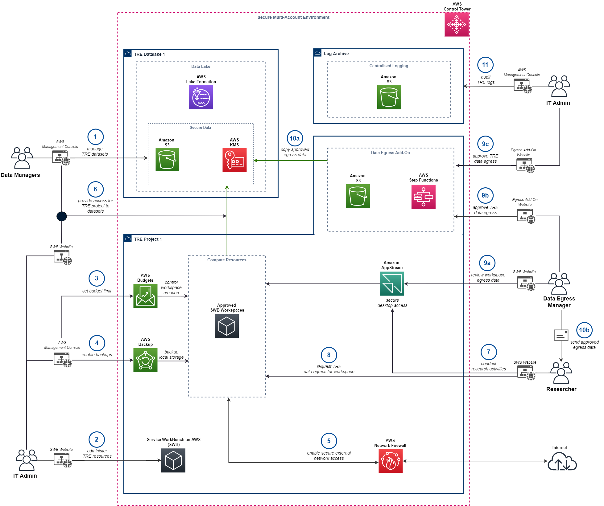
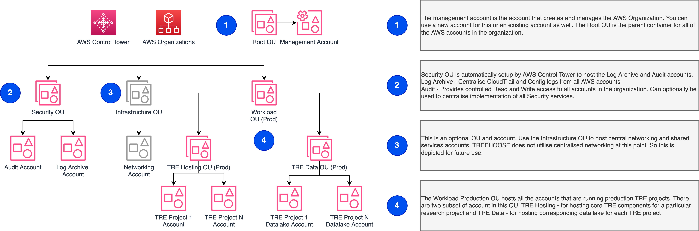
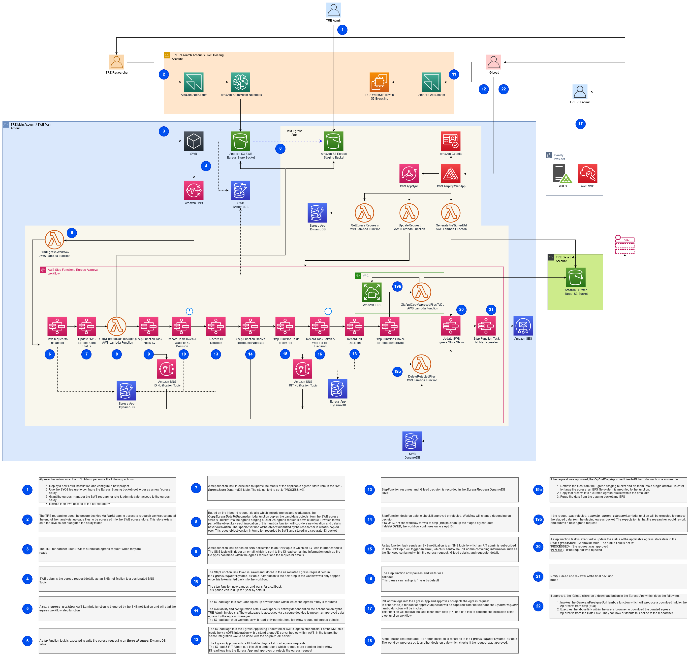
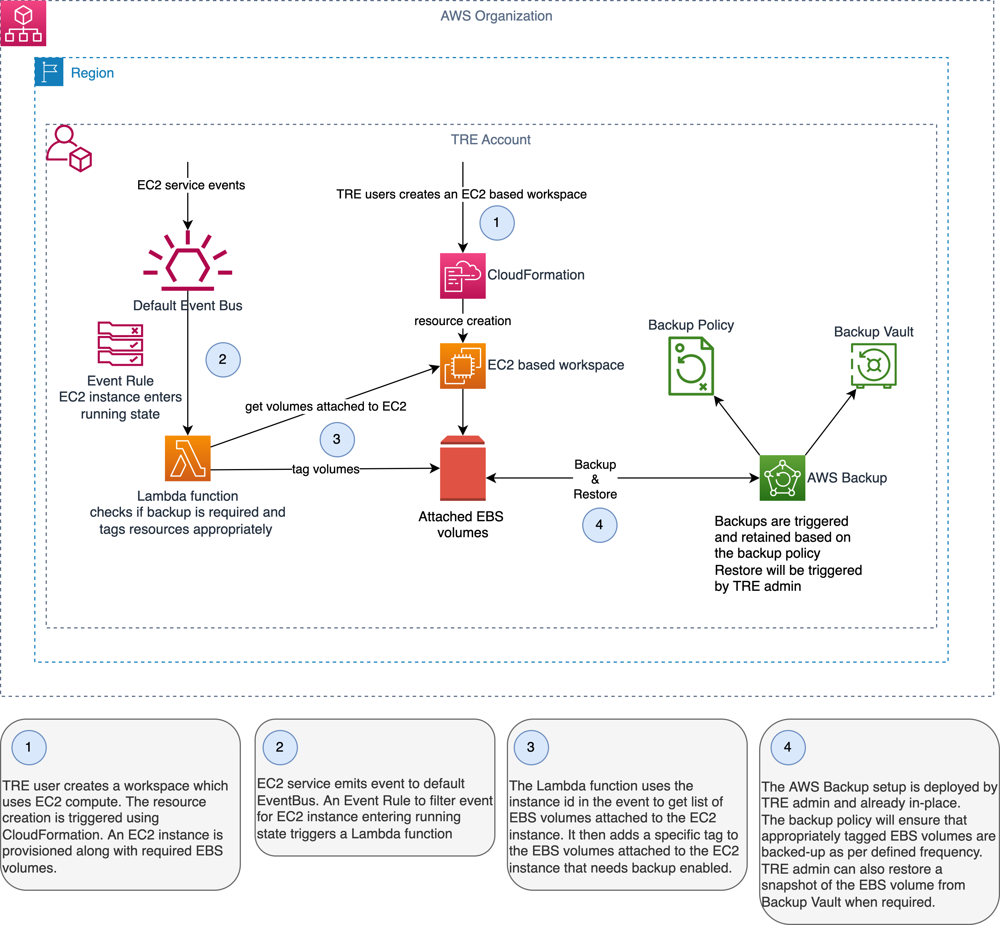
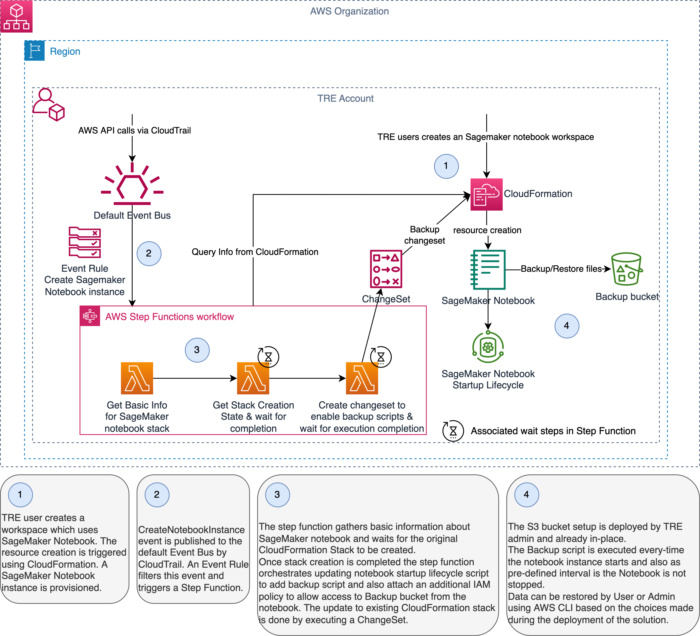

# Architecture

---

This document explains the high level architecture of
the Trusted Research Environment that would be deployed
on AWS Cloud following the installation
steps in this repository.

## Overview

---

The TREEHOOSE solution is formed of
[Service Workbench on AWS](https://aws.amazon.com/government-education/research-and-technical-computing/service-workbench/)
and a data lake that together provides the building blocks
for the Trusted Research Environment (TRE) capability.
[AWS Control Tower](https://aws.amazon.com/controltower/) provides the scalable
multi-account setup for managing TRE implementations at scale in AWS Cloud.

In addition to the basic building blocks TREEHOOSE solution
provides optional add-on components to enable

- Data egress
- Workspace backups
- Budget controls

TREEHOOSE is the Trusted Research Environment (TRE) implementation
that will be deployed for each research project.
Deploying the solution with the **default parameters**
builds the following environment in AWS Cloud.

The solution uses Infrastructure as Code for deployment.
Additional sections in this document provide additional details about each component. Below is a brief explanation
of the numbered steps in the diagram.

1. TRE Data Managers use AWS Management console to upload
   data to the TRE Data Lake to be used for research.
1. IT Administrators use the Service Workbench web application
   to administer resources in the TRE environment.
1. The budget controls component is used to set budget limits for the TRE
   project. IT Administrators can set the budget and any actions
   to be taken when the budget thresholds are breached.
1. Backup functionality for research workspaces can also be
   enabled. IT Admins can monitor
   these through AWS Backup.
1. Data Managers and IT Administrators can work together to provide researchers with access to relevant
   data sets from the data lake.
1. Researchers can create and connect to approved workspaces through the Service Workbench web application.
   They get secure access to compute resources using
   Amazon AppStream 2.0.
1. On research completion the researcher can request egress of
   research results.
1. The egress request is processed through a Data Egress App add-on
   with a comprehensive review process with multiple approvers
   before the data is available for download.
1. Egress requests that are approved can be downloaded by Data Egress Managers
  and shared with the Researcher who requested the data egress.
  There is a configurable limit to the number of downloads which can be made.
1. Audit & Compliance teams get full visibility into all
    user activities resulting in AWS API calls through centralised
    CloudTrail logs. Additionally, they get breakglass
    access to all TRE projects/accounts in the TRE through
    a Lambda function role in the Audit account.

## Component Overview

---

### *AWS Control Tower*

---

Using TREEHOOSE implemenation a user should be able to run multiple
isolated projects and trusted research environment in parallel
and scale according the organisation's research needs.

To enable TREEHOOSE implementation to support scalable research workloads
, meet the organization’s security and auditing requirements, and evolve with business requirements
it uses AWS Control Tower to set up and govern a secure,
multi-account AWS environment, called a landing zone.

Below is the high-level Organization Unit and Account Structure
that will be setup by using the TREEHOOSE solution.

### *Service Workbench on AWS Solution*

---

Service Workbench on AWS is a cloud solution that enables
IT teams to provide secure, repeatable, and federated control of
access to data, tooling, and compute power that researchers need.
Find more details [here](https://aws.amazon.com/government-education/research-and-technical-computing/service-workbench/).

Key Components :

- For the UI: AWS Lambda, AWS Lambda@Edge, Amazon CloudFront,
  Amazon S3. AWS SSO can be used for Single Sign-On (optional).
- For the backend: Amazon API Gateway, AWS Lambda,
  AWS Step Functions, AWS Service Catalog, Amazon DynamoDB, Amazon Cognito, Amazon S3.
- For research environments: AWS Service Catalog and AWS CloudFormation
  for deploying the environments; Amazon EC2, Amazon SageMaker, Amazon EMR, Amazon S3, ...
  (more services as desired; this is customisable by providing Service Catalog templates).
- For the secure access environment: AWS AppStream 2.0

### *Data Lake*

---

TREEHOOSE uses a data lake setup that
uses [AWS Lake Formation](https://aws.amazon.com/lake-formation/)
under the hoods for creating a secure and scalable
data store for storing research data.
A data lake is a centralized, curated, and secured repository that stores all your data,
both in its original form and prepared for analysis.
It creates a pre-configured data lake to be used for TRE data pipelines.
This is a mandatory add-on.

Key Components :

- AWS Lake Formation, Amazon S3, AWS KMS, AWS Glue, Amazon Athena

### *Data Egress Application*

---

This add-on provides a data egress approval workflow
for researchers to take out data from TRE with the permission of multiple parties
(data manager, research IT, etc.).
The add-on is hosted as a web application supported by
backend infrastructure. Each add-on installation is tied
to a specific TRE project.

The add-on provides a streamlined
process for securely egressing data from the TRE environment
while keeping the TRE admins and Data auditors in complete
control of the process.

All data egress requests and any actions performed on those
are recorded for Audit.

Key Components :

- For the UI: AWS Amplify
- For the backend: AWS Step Functions, Amazon EFS,
  AWS Lambda, Amazon DynamoDB, Amazon SES, Amazon S3, AWS KMS, Amazon SNS, Amazon Cognito, AWS AppSync

### *Workspace backup*

---

This add-on provides capability to periodically
backup researcher workspace to ensure that persistent
data is recoverable in-case researcher workspace is
terminated by mistake.

Once implemented this capability will enable
researchers to select whether they want to enable
periodic workspace backups when creating the workspace.

Only TRE administrators can control the backup frequency
and back retention periods. Also, any restore operations
need to be performed by admins.

This add-on uses [AWS Backup](https://aws.amazon.com/backup/) for backing up block storage attached to
[Amazon EC2](https://aws.amazon.com/ec2/) based compute workspaces while it uses a be-spoke
implementation to backup [Amazon SageMaker Notebook Instances](https://docs.aws.amazon.com/sagemaker/latest/dg/nbi.html)

Below diagrams explain how the backup solution works
for

1. EC2 based workspaces.

1. SageMaker notebook based workspaces

Key Components:

- For the backend: AWS Step Functions,
  AWS Lambda, Amazon CloudWatch Events, AWS CloudFormation, AWS Backup, Amazon S3

### *Budget controls*

---

Budget controls is an optional
add-on that allows administrators and finance stakeholders
of the TRE to stay on top of project finances.
This add-on can optionally be deployed for
each TRE project and allows to

- **Monitor** : set thresholds for sending budget alerts
- **Report** : sending notification on budget usage
- **Repond** : automate actions to avoid over-spending

The add-on uses [AWS Budgets](https://aws.amazon.com/aws-cost-management/aws-budgets/)
 to plan and set expectations around TRE project costs.

Key Components:

- For the backend: AWS Budgets, Amazon SNS, AWS IAM

## References

---

- <https://docs.aws.amazon.com/organizations/latest/userguide/orgs_getting-started_concepts.html>
- <https://docs.aws.amazon.com/prescriptive-guidance/latest/designing-control-tower-landing-zone/account-structure-ous.html>
- <https://aws.amazon.com/government-education/research-and-technical-computing/service-workbench/>
- <https://docs.aws.amazon.com/aws-backup/latest/devguide/how-it-works.html>
