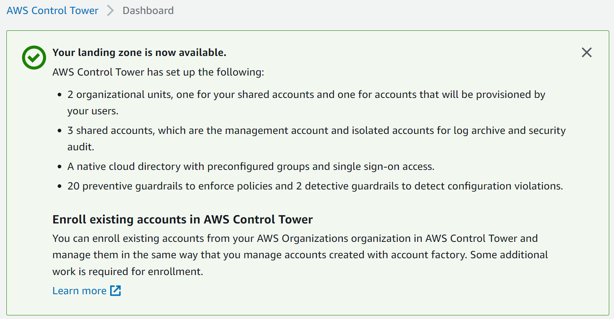
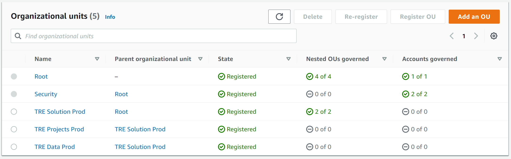
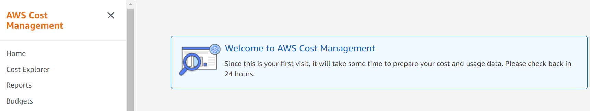
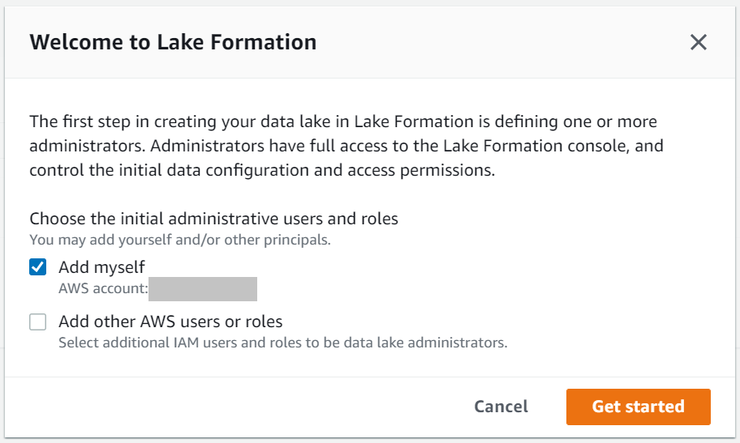

# Prerequisites

> Required before deploying the TREEHOOSE TRE solution

**Total time to configure**: Approximately 100 minutes

Ensure all steps below are executed in AWS region: [London (eu-west-2)](https://eu-west-2.console.aws.amazon.com/).

## Step 1. Setup Accounts

**Time to configure**: Approximately 85 minutes

Log in to the [AWS Management Console](https://console.aws.amazon.com/) using your organization's **Management** account.

The solution must be deployed in a multi-account environment created and managed using AWS Control Tower. The structure is shown in the image below.

> Optional: If you want to create more environments (e.g. Dev), then replicate the structure of the **TRE Environment (Prod)** group in the image and repeat steps 1E and 1F.

### Step 1A. Create Encryption Key for AWS Control Tower

**Time to configure**: Approximately 5 minutes

- [ ] Go to Service: [AWS CloudFormation](https://eu-west-2.console.aws.amazon.com/cloudformation/home?region=eu-west-2#/)
- [ ] Select the [*Stacks*](https://eu-west-2.console.aws.amazon.com/cloudformation/home?region=eu-west-2#/stacks) menu option on the left side
- [ ] Press button: [*Create Stack* with new resources](https://eu-west-2.console.aws.amazon.com/cloudformation/home?region=eu-west-2#/stacks/create/template)
- [ ] Select option *Upload a template file* to upload CloudFormation template file: [landing zone encryption](../../src/pre_requisites/LandingZoneEncryption-Cfn.yaml) and press on button *Next*
- [ ] Provide *Stack name*: "ControlTowerSetup-EncryptionKey-ManagementAccount", press on button *Next* twice and then press on button *Create stack*
- [ ] Confirm the stack status is "CREATE_COMPLETE"

### Step 1B. Create Landing Zone in AWS Control Tower

**Time to configure**: Approximately 25 minutes

- [ ] Go to Service: [AWS Control Tower](https://eu-west-2.console.aws.amazon.com/controltower)
- [ ] Press button: [*Set up landing zone*](https://eu-west-2.console.aws.amazon.com/controltower/home/setup?region=eu-west-2)

> Troubleshooting Note: If you see the message "Your AWS Environment is not ready for AWS Control Tower to be set up.", please refer to `TODO: insert link` (Expand on "Launch and terminate at least one EC2 instance (size of instance and duration of run prior to termination do not matter), as this establishes the base compute service limits") before proceeding.

Leave every option set to default in the Control Tower Landing Zone Setup, except:

- [ ] Step 1 Page - Ensure Home Region is *London*. Enable *Region deny setting*. Add *Additional AWS Regions for governance*: US East (N. Virginia) - us-east-1.
- [ ] Step 2 Page - For *Additional OU*, add **TRE Solution Prod**
- [ ] Step 3 Page - Provide email addresses for the **Log Archive** and **Audit** accounts. Enable KMS Encryption and select the **ControlTowerSetup-Landing-Zone** key created in Step 1A
- [ ] Step 4 Page - Ensure the list matches the diagram above for the **Default Setup** for the 3 initial accounts plus **TRE Solution Prod**, then press on button *Set up landing zone*

Wait until the Control Tower Landing Zone Setup completes successfully.

### Step 1C. Add encryption to enrolled accounts in AWS Control Tower

**Time to configure**: Approximately 5 minutes

Ensure the encryption key setup in Step 1A is also automatically applied to all enrolled Control Tower accounts.

- [ ] Go to Service: [AWS CloudFormation](https://eu-west-2.console.aws.amazon.com/cloudformation/home?region=eu-west-2#/)
- [ ] Select the [*StackSets*](https://eu-west-2.console.aws.amazon.com/cloudformation/home?region=eu-west-2#/stacksets) menu option on the left side
- [ ] If you get message "Enable trusted access with AWS Organizations to use service-managed permissions.", press on button *Enable trusted access*
- [ ] Press button: [*Create StackSet*](https://eu-west-2.console.aws.amazon.com/cloudformation/home?region=eu-west-2#/stacksets/create)
- [ ] Select option *Service-managed permissions*
- [ ] Select option *Upload a template file* to upload CloudFormation template file: [landing zone encryption](../../src/pre_requisites/templates/LandingZoneEncryption-Cfn.yaml) and press on button *Next*
- [ ] Provide *StackSet name*: "ControlTowerSetup-EncryptionKey" and press on button *Next* twice
- [ ] For *Deployment targets*, ensure *Automatic deployment* is set to Enabled and select region *eu-west-2 (London)*, then press on button *Next* and *Submit*
- [ ] Click on the stack set created and confirm the status is "ACTIVE"

### Step 1D. Change default settings in AWS Control Tower

**Time to configure**: Approximately 5 minutes

- [ ] Go to Service:
  [AWS Control Tower](https://eu-west-2.console.aws.amazon.com/controltower)
- [ ] Select
  [Account factory](https://eu-west-2.console.aws.amazon.com/controltower/home/accountfactory?region=eu-west-2)
- [ ] Follow these [instructions](https://docs.aws.amazon.com/controltower/latest/userguide/configure-without-vpc.html#create-without-vpc) to modify the default network configuration. The intent is to ensure AWS Control Tower doesn't create a VPC for every account created

### Step 1E. Create Organizational Units

**Time to configure**: Approximately 5 minutes (2.5 minutes per OU)

Manually create the remaining OUs in the diagram's **TRE Environment (Prod)** group.

- [ ] Go to Service: [AWS Control Tower](https://eu-west-2.console.aws.amazon.com/controltower)
- [ ] Select [Organizational units](https://eu-west-2.console.aws.amazon.com/controltower/home/organizationunits?region=eu-west-2)
- [ ] Press button *Add an OU*. Use OU name **TRE Projects Prod** and place it under Parent OU **TRE Solution Prod**. Wait until registration completes successfully
- [ ] Press button *Add an OU*. Use OU name **TRE Data Prod** and place it under Parent OU **TRE Solution Prod**. Wait until registration completes successfully

The current [organizational structure](https://eu-west-2.console.aws.amazon.com/controltower/home/organizationunits?region=eu-west-2) should match the image below.

### Step 1F. Create AWS Accounts

**Time to configure**: Approximately 40 minutes (20 minutes per account)

Manually create the remaining Accounts in the diagram's **TRE Environment (Prod)** group.

- [ ] Go to Service:
  [AWS Control Tower](https://eu-west-2.console.aws.amazon.com/controltower)
- [ ] Select
  [Account factory](https://eu-west-2.console.aws.amazon.com/controltower/home/accountfactory?region=eu-west-2)
- [ ] Press button *Enroll account*.
  Set *Display name* to **TRE-Project-1-Prod**.
  Place it under *Parent OU* **TRE Projects Prod**.
  Provide the required email address and press on button *Enroll account*.
  Wait until account creation completes successfully
  (check state under [Accounts](https://eu-west-2.console.aws.amazon.com/controltower/home/accounts?region=eu-west-2))
- [ ] Press button *Enroll account*.
  Set *Display name* to **TRE-Datalake-1-Prod**.
  Place it under *Parent OU* **TRE Data Prod**.
  Provide the required email address and press on button *Enroll account*.
  Wait until account creation completes successfully
  (check state under [Accounts](https://eu-west-2.console.aws.amazon.com/controltower/home/accounts?region=eu-west-2))

The resulting [organizational structure](https://eu-west-2.console.aws.amazon.com/controltower/home/organizationunits?region=eu-west-2) should match the image below.

## Step 2. Initialise Cost Explorer

**Time to configure**: Approximately 5 minutes

Log in to the [AWS Management Console](https://console.aws.amazon.com/) using your organization's **Management** account.

- [ ] Go to Service: [AWS Cost Explorer](https://us-east-1.console.aws.amazon.com/cost-management/home?region=eu-west-2)

If the service is not already initialised, a message will appear like in the image below.

## Step 3. Initialise Lake Formation

**Time to configure**: Approximately 5 minutes

Required for all accounts created under the **TRE Data Prod** OU.

Log in to the [AWS Management Console](https://console.aws.amazon.com/) using your **TRE Datalake 1 Prod** account.

- [ ] Go to Service: [AWS Lake Formation](https://eu-west-2.console.aws.amazon.com/lakeformation/home?region=eu-west-2)

A prompt will appear to add the current account as an administrator for Lake Formation. Select the option like in the image below and press on button *Get started*.

## Step 4. Initialise AppStream

**Time to configure**: Approximately 5 minutes

Required for all accounts created under the **TRE Projects Prod** OU.

Log in to the [AWS Management Console](https://console.aws.amazon.com/) using your **TRE Project 1 Prod** account.

- [ ] Go to Service: [Amazon AppStream 2.0](https://eu-west-2.console.aws.amazon.com/appstream2/home?region=eu-west-2#/)
- [ ] Press on button *Get Started*, then *Skip*. This will create a role in the background which will be used later in the deployment process.

## Appendix

These steps are optional, but recommended for implementing best practices on AWS.

- [ ] To secure the **Management** account, please follow these [instructions](https://docs.aws.amazon.com/organizations/latest/userguide/orgs_best-practices_mgmt-acct.html)
- [ ] To manage SSO access to your AWS accounts, please follow these [instructions](https://docs.aws.amazon.com/singlesignon/latest/userguide/manage-your-accounts.html)
- [ ] To allow IAM users to view Billing on AWS, please follow these [instructions](https://docs.aws.amazon.com/awsaccountbilling/latest/aboutv2/control-access-billing.html#ControllingAccessWebsite-Activate)
