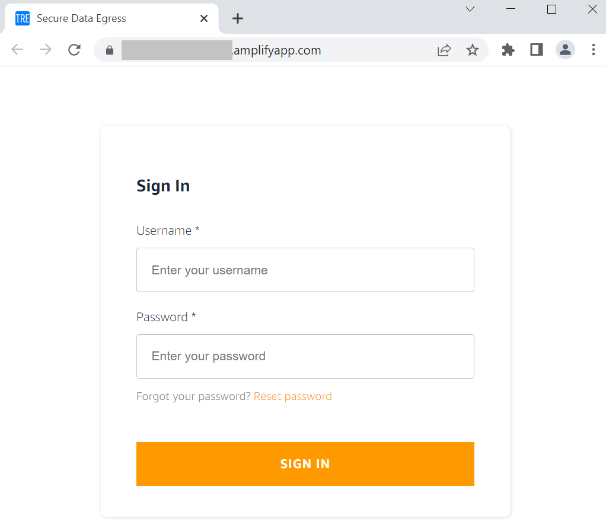

# Secure Data Egress App Deployment

Ensure all steps below are executed in AWS region: [London (eu-west-2)](https://eu-west-2.console.aws.amazon.com/).

If this add-on application is added, a researcher can use a GUI-based data egress approval workflow
 to take out data from the TRE with the permission of multiple parties (Information Governance Lead, Research IT).

**Total time to deploy**: Approximately 35 minutes (without prerequisites)

## Prerequisites

Apply these prerequisites only to accounts that are part of the **TRE Projects Prod** OU.

Log in to the [AWS Management Console](https://console.aws.amazon.com/) using your **TRE Project 1 Prod**
 account and Admin privileges.

### Remove email restrictions

By default, a new AWS account will be placed in the [Amazon SES](https://aws.amazon.com/ses/) sandbox
 which enforces a set of [restrictions](https://docs.aws.amazon.com/ses/latest/dg/request-production-access.html).

To enable the egress app to send email notifications to signed-up users (information governance leads,
 IT admins and researchers), an admin must manually add each user's email as a verified entity in SES. Following
 that, the user must confirm the subscription using a link received in an email.

To skip the need to manually add and verify each email address in Amazon SES, you should request production
 access to SES by following these [instructions](https://docs.aws.amazon.com/ses/latest/dg/request-production-access.html).

## Step 4. Deploy Data Egress App

**Time to deploy**: Approximately 35 minutes

### Step 4A. Log in to the EC2 instance

- [ ] Follow these instructions to learn how to connect via SSM to the EC2 instance created in Step 1.
- [ ] Run the following command to log in and initialise your environment:

```shell
sudo -iu ec2-user
```

### Step 4B. Deploy backend infrastructure

**Time to deploy**: Approximately 20 minutes

Apply these steps only to accounts that are part of the **TRE Projects Prod** OU.

Log in to the [AWS Management Console](https://console.aws.amazon.com/) using your **TRE Project 1 Prod**
 account and Admin privileges.

- [ ] Edit file [`cdk.json`](../../src/components/egress_app_backend/cdk.json) in the `/home/ec2-user/tmp/TREEHOOSE/src/components/egress_app_backend/` directory (Step 1C). Change the following required
 parameters for the CDK backend stack:

|Parameter Name|Description|Location|AWS Account|
|:-----------------|:-----------|:-------------|:------------|
|swb_egress_store_arn|Provide resource created in Step 2 - S3 Bucket: Egress Store Bucket Arn (`EgressStoreBucket`)|Check [AWS CloudFormation](https://eu-west-2.console.aws.amazon.com/cloudformation/home?region=eu-west-2#/) *Resources* tab for *Stack* "treprod-ldn-pj1-backend" or go to [Amazon S3 Buckets](https://s3.console.aws.amazon.com/s3/buckets?region=eu-west-2)| **TRE Project 1 Prod** account |
|swb_egress_notification_topic|Provide resource created in Step 2 - SNS Topic: Egress Notification Topic Arn (`EgressNotificationTopic`)|Check [AWS CloudFormation](https://eu-west-2.console.aws.amazon.com/cloudformation/home?region=eu-west-2#/) *Resources* tab for *Stack* "treprod-ldn-pj1-backend" or go to [Amazon SNS Topics](https://eu-west-2.console.aws.amazon.com/sns/v3/home?region=eu-west-2#/topics)| **TRE Project 1 Prod** account |
|swb_egress_notification_bucket_arn|Provide resource created in Step 2 - S3 Bucket: Egress Notification Bucket Arn (`EgressNotificationBucket`)|Check [AWS CloudFormation](https://eu-west-2.console.aws.amazon.com/cloudformation/home?region=eu-west-2#/) *Resources* tab for *Stack* "treprod-ldn-pj1-backend" or go to [Amazon S3 Buckets](https://s3.console.aws.amazon.com/s3/buckets?region=eu-west-2)| **TRE Project 1 Prod** account |
|swb_egress_notification_bucket_kms_arn|Provide resource created in Step 2 - KMS Key: Egress Store Encryption Key Arn (`EgressStoreEncryptionKey`)|Check [AWS CloudFormation](https://eu-west-2.console.aws.amazon.com/cloudformation/home?region=eu-west-2#/) *Resources* tab for *Stack* "treprod-ldn-pj1-backend" or go to [AWS KMS Keys](https://eu-west-2.console.aws.amazon.com/kms/home?region=eu-west-2#/kms/keys)| **TRE Project 1 Prod** account |
|swb_egress_store_db_table|Provide resource created in Step 2 - DynamoDB Table: Egress Store Table Arn (`EgressStoreDb`)|Check [AWS CloudFormation](https://eu-west-2.console.aws.amazon.com/cloudformation/home?region=eu-west-2#/) *Resources* tab for *Stack* "treprod-ldn-pj1-backend" or go to [Amazon DynamoDB Tables](https://eu-west-2.console.aws.amazon.com/dynamodbv2/home?region=eu-west-2#tables)| **TRE Project 1 Prod** account |
|datalake_target_bucket_arn|Provide resource created in Step 3 - S3 Bucket: TRE Target Bucket (output `TRETargetBucketArn`)|Check [AWS CloudFormation](https://eu-west-2.console.aws.amazon.com/cloudformation/home?region=eu-west-2#/) *Resources* tab for *Stack* "TREDataLake1" or go to [Amazon S3 Buckets](https://s3.console.aws.amazon.com/s3/buckets?region=eu-west-2)| **TRE Datalake 1 Prod** account |
|datalake_target_bucket_kms_arn|Provide resource created in Step 3 - KMS Key: TRE Target Bucket KMS Key (output `TRETargetBucketKMSKeyArn`)|Check [AWS CloudFormation](https://eu-west-2.console.aws.amazon.com/cloudformation/home?region=eu-west-2#/) *Resources* tab for *Stack* "TREDataLake1" or go to [AWS KMS Keys](https://eu-west-2.console.aws.amazon.com/kms/home?region=eu-west-2#/kms/keys)| **TRE Datalake 1 Prod** account |
|cognito_userpool_domain|Provide name for a new Amazon Cognito domain to be created, e.g. `treprod-pj1-egress-userpool`|To view resources created after deployment of this CDK stack, go to service [Amazon Cognito](https://eu-west-2.console.aws.amazon.com/cognito/home?region=eu-west-2)| **TRE Project 1 Prod** account |
|tre_admin_email_address|Provide a TRE admin email address that will need to be verified after deployment|To view verified identities after deployment of this CDK stack, go to service [Amazon SES](https://eu-west-2.console.aws.amazon.com/ses/home?region=eu-west-2#/verified-identities)| **TRE Project 1 Prod** account |

- [ ] Run the following commands to create an isolated Python environment and deploy the CDK backend stack, replacing `DEPLOYMENT_ACCOUNT` with TRE Project 1 Prod account ID:

```bash
cd /home/ec2-user/tmp/TREEHOOSE/src/components/egress_app_backend/
alias cdkv1="npx aws-cdk@1.154"
python3 -m venv .venv
source .venv/bin/activate
pip3 install -r requirements.txt
cdkv1 bootstrap aws://DEPLOYMENT_ACCOUNT/eu-west-2
cdkv1 deploy
```

### Step 4C. Deploy web app

**Time to deploy**: Approximately 10 minutes

Apply these steps only to accounts that are part of the **TRE Projects Prod** OU.

Log in to the [AWS Management Console](https://console.aws.amazon.com/) using your **TRE Project 1 Prod**
 account and Admin privileges.

- [ ] Edit file *.env.local* in the `/home/ec2-user/tmp/TREEHOOSE/src/components/egress_app_frontend/` directory (Step 1C). Change the following required
 parameters for the web application:

|Parameter Name|Description|Location|AWS Account|
|:-----------------|:-----------|:-------------|:------------|
|REACT_APP_APPSYNC_API|Provide resource created in Step 4B - Egress API URL (e.g. "<https://.../graphql>) |Check [AWS CloudFormation](https://eu-west-2.console.aws.amazon.com/cloudformation/home?region=eu-west-2#/) *Outputs* tab for *Stack* "EgressAppBackend" and locate *AppSyncGraphQLURL* or go to [AWS AppSync APIs](https://eu-west-2.console.aws.amazon.com/appsync/home?region=eu-west-2#/apis) -> Select the API created -> *Settings* -> *API URL* | **TRE Project 1 Prod** account |
|REACT_APP_USER_POOL_CLIENT_ID|Provide resource created in Step 4B - App Client Id |Check [AWS CloudFormation](https://eu-west-2.console.aws.amazon.com/cloudformation/home?region=eu-west-2#/) *Outputs* tab for *Stack* "EgressAppBackend" and locate *CognitoAppClientId* or go to [Amazon Cognito Pools](https://eu-west-2.console.aws.amazon.com/cognito/users/?region=eu-west-2#) -> Select the User Pool created -> Under *General settings* -> *App clients* -> *App client id* | **TRE Project 1 Prod** account |
|REACT_APP_USER_POOL_ID|Provide resource created in Step 4B - User Pool Id |Check [AWS CloudFormation](https://eu-west-2.console.aws.amazon.com/cloudformation/home?region=eu-west-2#/) *Outputs* tab for *Stack* "EgressAppBackend" and locate *CognitoUserPoolId* or go to [Amazon Cognito Pools](https://eu-west-2.console.aws.amazon.com/cognito/users/?region=eu-west-2#) -> *General settings* -> *Pool Id* | **TRE Project 1 Prod** account |
|REACT_APP_USER_POOL_DOMAIN|Provide resource created in Step 4B - User Pool Domain Name (e.g. {cognito_userpool_domain}.auth.eu-west-2.amazoncognito.com) |Check [AWS CloudFormation](https://eu-west-2.console.aws.amazon.com/cloudformation/home?region=eu-west-2#/) *Outputs* tab for *Stack* "EgressAppBackend" and locate *CognitoUserPoolDomain* or go to [Amazon Cognito Pools](https://eu-west-2.console.aws.amazon.com/cognito/users/?region=eu-west-2#) -> Under *App integration* -> *Domain name* | **TRE Project 1 Prod** account |
|REACT_APP_REGION|Provide current AWS Region (i.e. eu-west-2)|NA| **TRE Project 1 Prod** account |
|REACT_APP_EGRESS_IG_ROLE|Provide same value as in cdk.json file edited in Step 4B for parameter *egress_reviewer_roles* - value 1|Check [AWS CloudFormation](https://eu-west-2.console.aws.amazon.com/cloudformation/home?region=eu-west-2#/) *Outputs* tab for *Stack* "EgressAppBackend" and locate *EgressReviewerRole1*| **TRE Project 1 Prod** account |
|REACT_APP_EGRESS_RIT_ROLE|Provide same value as in cdk.json file edited in Step 4B for parameter *egress_reviewer_roles* - value 2|Check [AWS CloudFormation](https://eu-west-2.console.aws.amazon.com/cloudformation/home?region=eu-west-2#/) *Outputs* tab for *Stack* "EgressAppBackend" and locate *EgressReviewerRole2*| **TRE Project 1 Prod** account |
|REACT_APP_MAX_DOWNLOADS_ALLOWED|Provide same value as in cdk.json file edited in Step 4B for parameter *max_downloads_allowed* |Check [AWS CloudFormation](https://eu-west-2.console.aws.amazon.com/cloudformation/home?region=eu-west-2#/) *Outputs* tab for *Stack* "EgressAppBackend" and locate *MaxDownloadsAllowed*| **TRE Project 1 Prod** account |

- [ ] Run the following commands to build the React frontend code:

```bash
cd /home/ec2-user/tmp/TREEHOOSE/src/components/egress_app_frontend/
nvm install v16.15.0
nvm use v16.15.0
npm install
npm run build
```

- [ ] Run the following commands to build the React app:

```bash
cd /home/ec2-user/tmp/TREEHOOSE/src/components/egress_app_frontend/build
zip -r ../build.zip ./
```

- [ ] Run the following commands to copy the React app to S3 and trigger an automatic
 deployment to Amplify:

```bash
cd /home/ec2-user/tmp/TREEHOOSE/src/components/egress_app_frontend/
aws s3 cp build.zip s3://{egress web app bucket created in Step 4B}
```

To find the egress web app bucket name, you can check - using the **TRE Project 1 Prod** account -
the [AWS CloudFormation](https://eu-west-2.console.aws.amazon.com/cloudformation/home?region=eu-west-2#/)
*Outputs* tab for *Stack* "EgressAppBackend" and locate *EgressWebAppS3BucketName*

Verify the Amplify app has been updated automatically and the website is reachable:

- [ ] Go to Service: [AWS Amplify](https://eu-west-2.console.aws.amazon.com/amplify/home?region=eu-west-2#/)
- [ ] Select the app and branch created in Step 4B
- [ ] Confirm the status in the app branch is: *Deployment successfully completed.*
- [ ] Open the URL from *Domain* and confirm a login prompt appears like in the image below



## Appendix

The web application deployed by the Egress Application does not have web application
firewall protection enabled by default.
For additional security follow [these](https://docs.aws.amazon.com/waf/latest/developerguide/getting-started.html) steps to
deploy a an [AWS WAF](https://aws.amazon.com/waf/).
As Amplify does not natively support integration with WAF
deploy the Egress Application Web App using [these](https://docs.aws.amazon.com/prescriptive-guidance/latest/patterns/deploy-a-react-based-single-page-application-to-amazon-s3-and-cloudfront.html)
instructions.
The CloudFront distribution created by the deployment can then be attached to WAF.

AWS WAF ruleset baseline for WebApps is as follows:

- Bot control (50 WCU)
- Admin protection (100 WCU)
- Amazon IP reputation list (25 WCU)
- Anonymous IP list (50 WCU)
- Core rule set (700 WCU)
- Known bad inputs (200 WCU)
