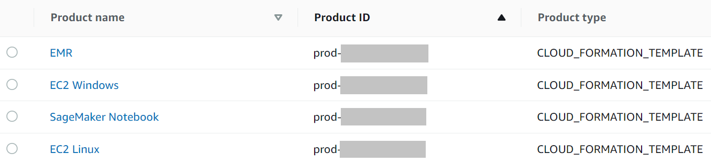
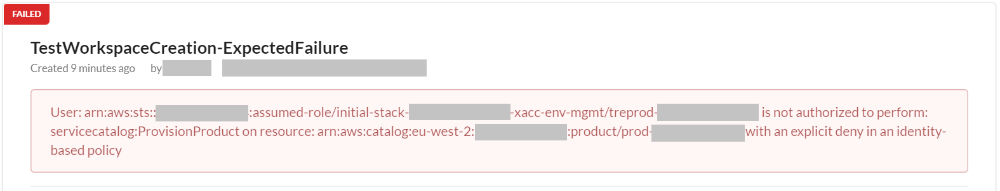
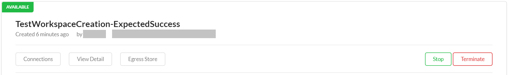

Ensure all steps below are executed in AWS region: [London (eu-west-2)](https://eu-west-2.console.aws.amazon.com/).

## Step 5. Add Project Budget Controls

**Time to deploy**: Approximately 10 minutes

Due to design considerations, do this step once for any account part of the **TRE Projects Prod** OU.

Log in to the [AWS Management Console](https://console.aws.amazon.com/) using your **TRE Project 1 Prod** account and Admin privileges.

### Step 5A. Locate existing IAM role

- [ ] Go to Service: [AWS Identity and Access Management](https://us-east-1.console.aws.amazon.com/iamv2/home#/home)
- [ ] Select the [*Roles*](https://us-east-1.console.aws.amazon.com/iamv2/home#/roles) menu option on the left side
- [ ] Search for *initial-stack*
- [ ] Extract number ID from role: *initial-stack-<number_ID>-xacc-env-mgmt*. This number is required in Step 5C

### Step 5B. Locate existing Service Catalog products

- [ ] Go to Service: [AWS Service Catalog](https://eu-west-2.console.aws.amazon.com/servicecatalog/home?region=eu-west-2#/home)
- [ ] Select the [*Portfolios*](https://eu-west-2.console.aws.amazon.com/servicecatalog/home?region=eu-west-2#portfolios?activeTab=localAdminPortfolios) menu option on the left side and click on the local portfolio created during SWB deployment (e.g. treprod-ldn-pj1)
- [ ] Extract product ID from *prod-<ID>* from the products list which should contain 4 default SWB products. These numbers are required in Step 5C

For guidance identifying the products, please refer to the image below.

### Step 5C. Add Project Budget Control

- [ ] Go to Service: [AWS CloudFormation](https://eu-west-2.console.aws.amazon.com/cloudformation/home?region=eu-west-2#/)
- [ ] Select the [*Stacks*](https://eu-west-2.console.aws.amazon.com/cloudformation/home?region=eu-west-2#/stacks) menu option on the left side
- [ ] Press button: [*Create Stack* with new resources](https://eu-west-2.console.aws.amazon.com/cloudformation/home?region=eu-west-2#/stacks/create/template)
- [ ] Select option *Upload a template file* to upload CloudFormation template file: [project budget controls](../../src/components/ProjectBudgetControl-Cfn.yaml) and press on button *Next*
- [ ] Provide *Stack name*: "TREProject1ProdBudgetControl". Add the parameters required. Press on button *Next* twice and then press on button *Create stack*

|Parameter Name|Description|Default value|
|:-----------------|:-----------|:-------------|
|AnnualBudgetLimit|Estimated annual account spend in USD|*No default - must be specified*|
|NotificationThresholdActualCost1|Budget threshold percentage for receiving first notification based on actual costs|*80*|
|NotificationThresholdActualCost2|Budget threshold percentage for receiving second notification based on actual costs|*99*|
|NotificationThresholdForecastedCost|Budget threshold percentage for notification based on forecasted costs|*90*|
|ActionThreshold|Budget threshold percentage for stopping new SWB workspace creation based on forecasted costs|*99*|
|BudgetNotifySNSTopicName|The name of the SNS topic whose subscribers (includes TREAdminEmailAddress) receive alerts regarding project budget|*No default - must be specified*|
|TREAdminEmailAddress|The email address for the TRE admin who will receive alerts regarding project budget|*No default - must be specified*|
|SWBStackID|Specify the ID of existing IAM role initial-stack-ID-xacc-env-mgmt|*No default - must be specified*|
|ServiceCatalogProductsList|Specify the 4 IDs (separated by commas) of the existing Service Catalog products created by SWB|*No default - must be specified*|

- [ ] Confirm the stack status is "CREATE_COMPLETE"

When the budget action gets triggered (depends on *AnnualBudgetLimit* and *ActionThreshold*), any allowed user trying to create a new workspace in SWB will see this error message:

### Step 5D. Adjust Project Budget

This step is optional if you need to update the project budget settings.

- [ ] Go to Service: [AWS CloudFormation](https://eu-west-2.console.aws.amazon.com/cloudformation/home?region=eu-west-2#/)
- [ ] Select the [*Stacks*](https://eu-west-2.console.aws.amazon.com/cloudformation/home?region=eu-west-2#/stacks) menu option on the left side
- [ ] Select the stack created in Step 5C and press on button *Update* to adjust the parameters. Please note the changes will take up to 24 hours to reflect in AWS Budgets in terms of alerts and actions.

### Step 5E. Remove Project Budget Control

This step is optional if you need to remove the project budget control policy after e.g. increasing your budget.

- [ ] Go to Service: [AWS Identity and Access Management](https://us-east-1.console.aws.amazon.com/iamv2/home)
- [ ] Select the [*Roles*](https://us-east-1.console.aws.amazon.com/iamv2/home#/roles) menu option on the left side
- [ ] Search for *initial-stack* to locate the role with name *initial-stack-ID-xacc-env-mgmt* (ID is a number)
- [ ] Click on the role identified above and select the policy that has *-DenyCreateWorkSpacePolicy-* in its name
- [ ] Use the *Remove* button on the right side to detach the policy from the role

When the budget control policy has been removed, any allowed user trying to create a new workspace in SWB will see the Available status message:

