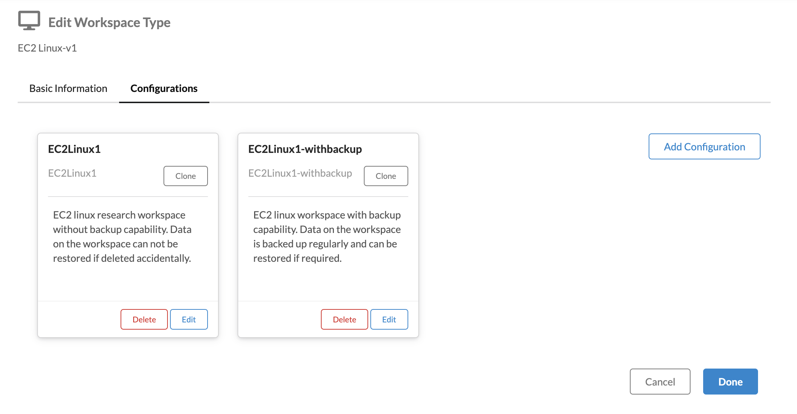
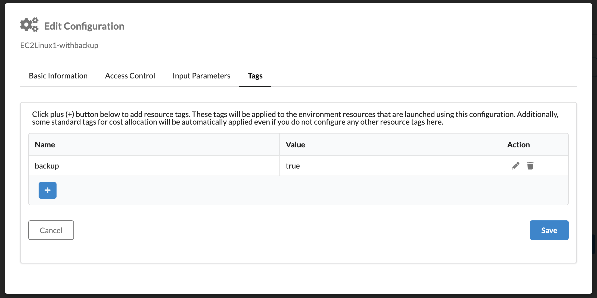
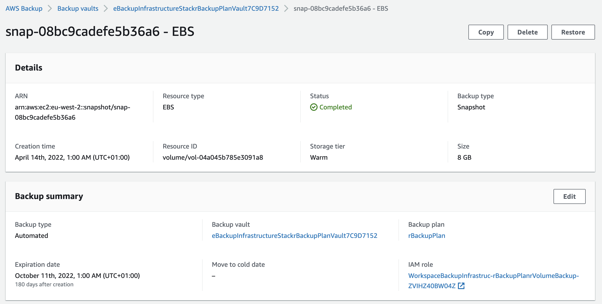
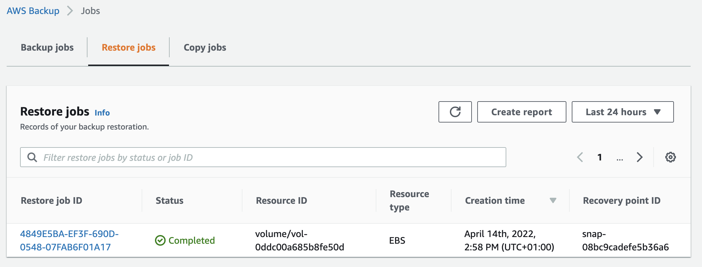
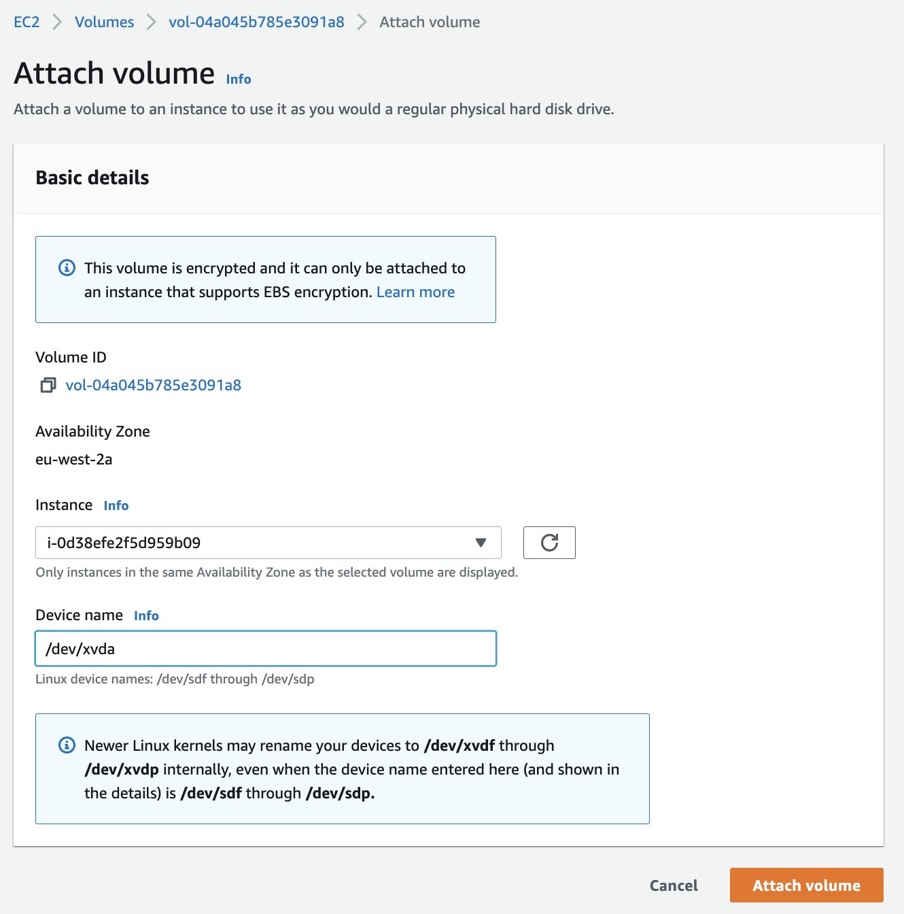

# Workspace Backups Operations Guide

---

## Workspace Configuration Update to Enable Backups

---

Once the component is deployed, the TRE administrator
needs to add specific tag to workspace configurations to
make backup enabled workspaces available to the researchers.

Note that the cost associated with a backup enabled workspace
will be higher compared to the one without backups as the storage
of backups will be added.

The below steps provide an illustration of enabling
backups for a workspace.

1. Login to the TRE Web App as a TRE admin.

1. Navigate to `Workspace Types`

1. Click `Edit` for one of the approved workspace types for
   which you want to enable backups.

1. Click on `Configurations` tab, and clone an existing workspace
   configuration. Update the id, name and description of the workspace.
   

1. In the last step add the backup tag as shown in screenshot.
   If you changed the backup tag value in `cdk.json` the same should
   go in here.
   

1. Click `Done`. The workspace with backup configuration
   should now be available to researchers to create.

## Restoring Workspace Backups

---

This section is intended for TRE admins to enable
them to restore workspace backups when requested
by a researcher.

### Restoring EBS volume

**Time to restore**: Approximately 15 minutes

EBS volume backup are created for Workspaces backed by
EC2 compute. There are multiple ways in which files from
an EBS can be restored, this guide only explain restoring
EBS by replacing it on the Workspace.

1. The workspace that needs to be restored must be in stopped state.
   This can be done by Researcher or Admin from the TRE Web App.
1. TRE Admin should have the workspace instance id handy for completing these steps.
1. Log in to the [AWS Management Console](https://console.aws.amazon.com/)
   of the TRE account using Admin privileges.

1. Navigate to the EC2 console, filter Instances with the instance id
   for which the restore needs to be carried out and click the
   instance id

1. Navigate to `Networking` tab and note `Availability zone`.
   The EBS volume needs to be restored to the same Availability zone
   in which the EC2 instance is placed.

1. Navigate to `Storage` tab and note `Volume ID`, `Device name`, and `Volume size (GiB)`

1. Click on the `Volume ID` which should take you to `volumes` page, select
   the volume, click on `Action`->`Detach volume`, confirm `Detach`

      *Note : At this point if the detached volume is no longer required it should be deleted.*

1. Navigate to [AWS Backup](https://eu-west-2.console.aws.amazon.com/backup/home?region=eu-west-2#/) console, navigate to `Backup vaults`
   , click on the vault name.

1. Use the `Volume ID` to search backups. Based on the backup frequency
   there
   will be multiple recovery points.
   Select the most appropriate
   recovery point.

1. After identifying the restore point to restore the EBS volume,
   click on the recovery point ARN and select the Restore button.
   

1. The restore of the ARN will bring you to a Restore backup screen
   that will have the snapshot ID, and other configurations.
   Fill the details as per below table and click on `Restore backup` button.

      |Parameter|Value|
      |----|----|
      |Resource Type| Specify EBS volume.|
      |Volume type| Select General Purpose SSD (gp2).|
      |Size| Select equivalent size of the backed up EBS volume as noted earlier.|
      |IOS| 300/3000 - Baseline of 3 iops per GiB with a minimum of 100 IOPS, burstable to 3000 IOPS.|
      |Availability Zone| Select the Availability Zone
      for the EC2 instance as noted in previous step|
      |Restore role| Select Default role|

1. This will take you to restored jobs screen.
   The restored backup job will appear under Restore jobs in the the
   [AWS Backup](https://eu-west-2.console.aws.amazon.com/backup/home?region=eu-west-2#/) console.
   Once the job status appears as completed, note the
   volume id of the restored volume.
   

1. Navigate to the Amazon
   [EC2 console](https://eu-west-2.console.aws.amazon.com/ec2/v2/home?region=eu-west-2#Volumes:), select Volumes under
   Elastic Block Store to see the restored EBS volumes.

1. Select the volume, click on `Action`->`Attach volume`, select the correct
   `Instance` from the drop down and provide
   the `Device name` as noted in previous step.
   

1. The restored volume should now be attached to the
   EC2 instance. The researcher or admin should now be able to start
   the Workspace.

1. Once the EC2 instance is in Running state, the TRE admin should
   verify that a tag with name `backupVolume` and value `true`
   should be added to the newly restored volume.

### Restoring SageMaker files

SageMaker notebook files are backed up to Amazon S3 bucket.
A prefix for each workspace is created in the Backup bucket
and files corresponding to each workspace are uploaded
to it's corresponding prefix in S3.

The bucket has versioning enabled so user can restore a specific
version of file if required.

#### **Self-service**

**Time to restore**: Approximately 15 minutes

TRE user can follow these steps for restoring the files
if TRE administrator has
enabled self-service for restore while installing the backup component.

1. TRE user or admin logs into the SageMaker notebook. Keep notebook instance name
   handy.

1. TRE user or admin opens `Terminal` using File -> New -> Terminal

1. Use [list-objects](https://docs.aws.amazon.com/cli/latest/reference/s3api/list-objects.html)
   aws cli command to list objects available to restore.

   Example

   ```console
   aws s3api list-objects --bucket sagemaker-backup-bucket-AWSACCOUNTNUMBER-eu-west-2 --prefix NOTEBOOK_NAME/
   ```

1. Identify the object that you want to restore from the list.
   Use [get-object](https://docs.aws.amazon.com/cli/latest/reference/s3api/get-object.html)
   aws cli command to restore the file.

   Example

   ```console
   aws s3api get-object --bucket sagemaker-backup-bucket-AWSACCOUNTNUMBER-eu-west-2 --key NOTEBOOK_NAME/FILE_NAME FILE_NAME
   ```

   By default the above command will restore
   the latest version of the file. Optionally, the user can also pass `--version-id`
   parameter to restore a specific version of the file.

#### **TRE Admin**

**Time to restore**: Approximately 15 minutes

If the TRE Admin has not enabled self service to restore
files the restoration work needs to be undertaken by the TRE Admin.

1. Log in to the [AWS Management Console](https://console.aws.amazon.com)
   of your **TRE Account** with Administrative privileges.

1. Navigate to
   [Amazon SageMaker console](https://eu-west-2.console.aws.amazon.com/sagemaker/home?region=eu-west-2#/landing).
   Click on Notebook -> Notebook instances.
   Click on Notebook name on which files need to be restored.

1. Under Permissions and encryption click on the IAM role ARN.

1. This will re-direct to IAM console. Click Add permissions -> Create inline policy

1. Switch to JSON view and paste below policy
   to enable permissions to restore files from S3 bucket.
   Replace values for `BACKUP_BUCKET` and `NOTEBOOK_NAME` variables.

   ```json
      {
         "Version": "2012-10-17",
         "Statement": [
            {
                  "Effect": "Allow",
                  "Action": ["s3:ListBucket"],
                  "Resource": [
                     "arn:aws:s3:::BACKUP_BUCKET/NOTEBOOK_NAME"
                  ],
                  "Condition": {
                     "StringEquals": {
                        "s3:prefix": "NOTEBOOK_NAME"
                     }
                  }
            },
            {
                  "Effect": "Allow",
                  "Action": [
                     "s3:GetObject",
                     "s3:GetObjectVersion"
                  ],
                  "Resource": [
                     "arn:aws:s3:::BACKUP_BUCKET/NOTEBOOK_NAME/*"
                  ],
            },
         ],
      }
   ```

. Click on Review Policy. Provide policy name as `sagemaker-restore-policy-for-NOTEBOOK_NAME`
   after replacing NOTEBOOK_NAME with actual value.
   Click on Create Policy.

The above set of steps enables the IAM permissions for performing
restore activity.
Follow the self-service steps to restore necessary files.

Once restoration work is completed, TRE Admin should delete the
inline policy added earlier. Failure to do so will result in errors
while terminating the SageMaker Notebook workspace as CloudFormation
will not be able to delete the IAM role associated with the Notebook.

## References

- <https://aws.amazon.com/getting-started/hands-on/amazon-ebs-backup-and-restore-using-aws-backup/>