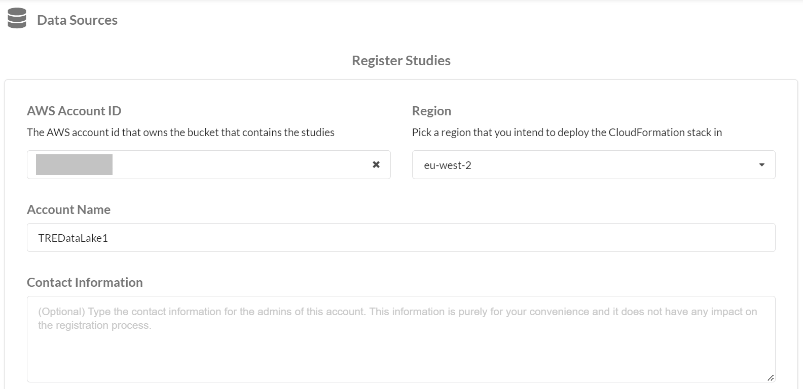
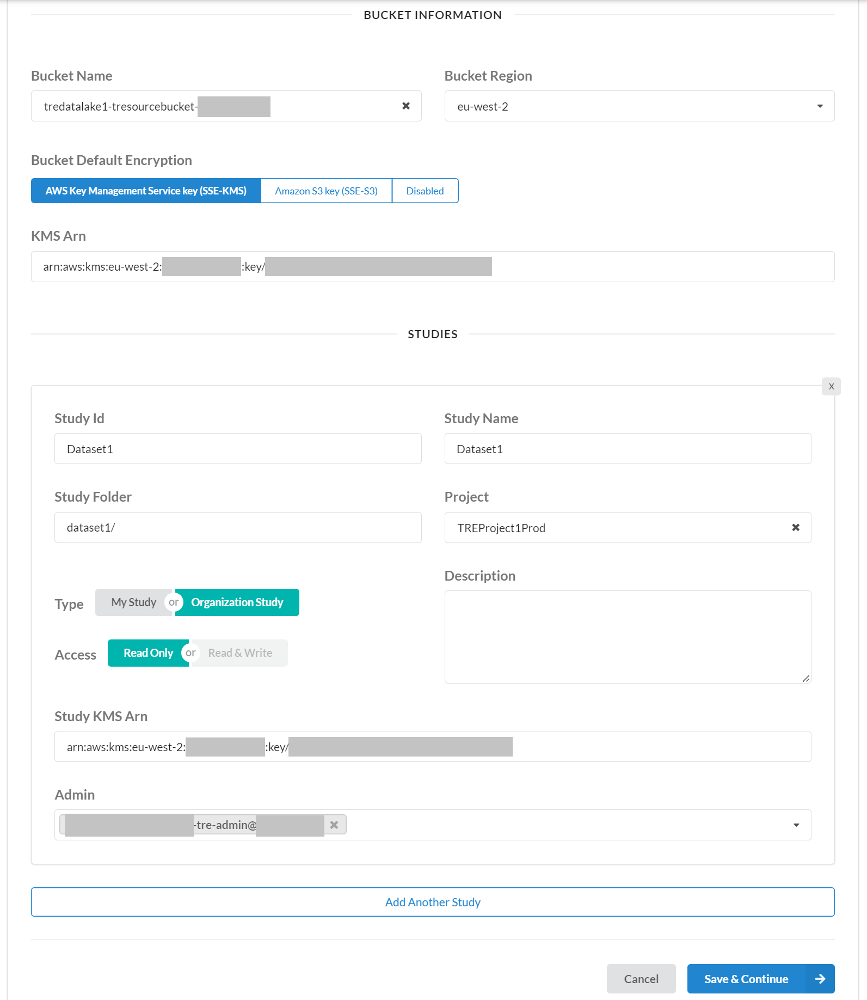
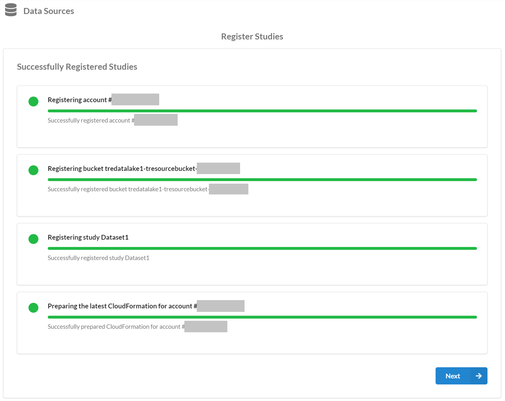
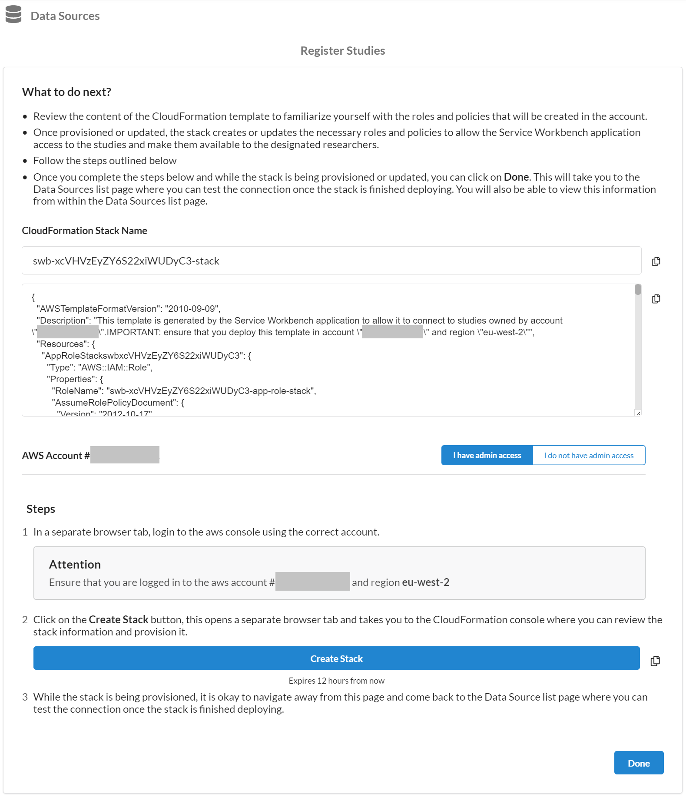
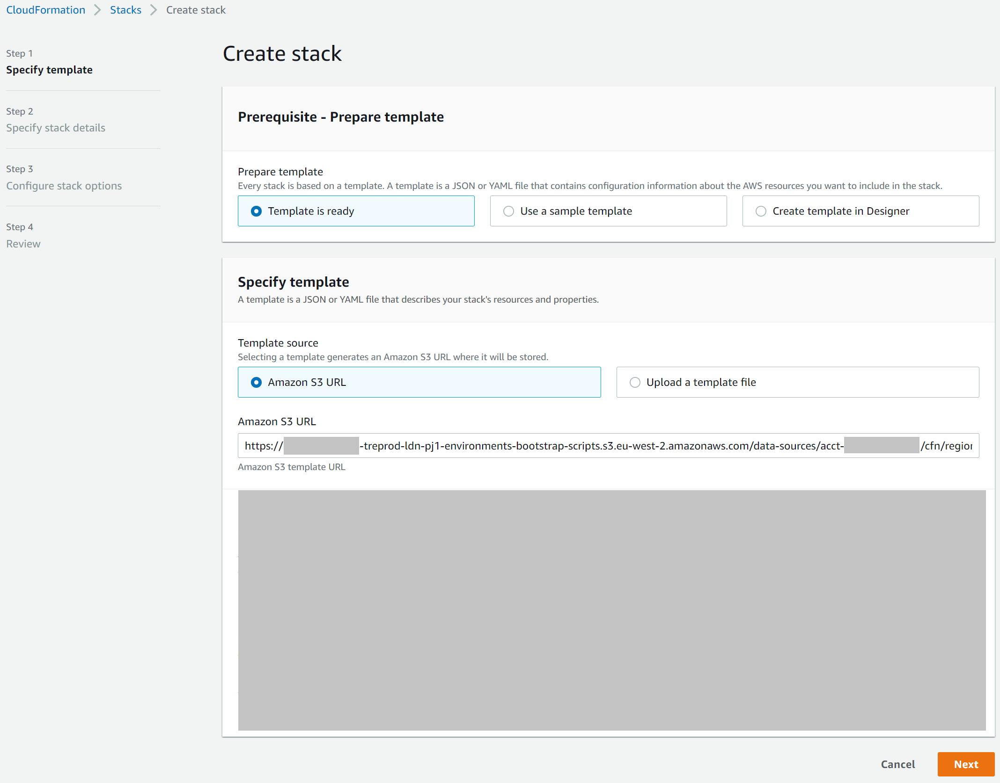
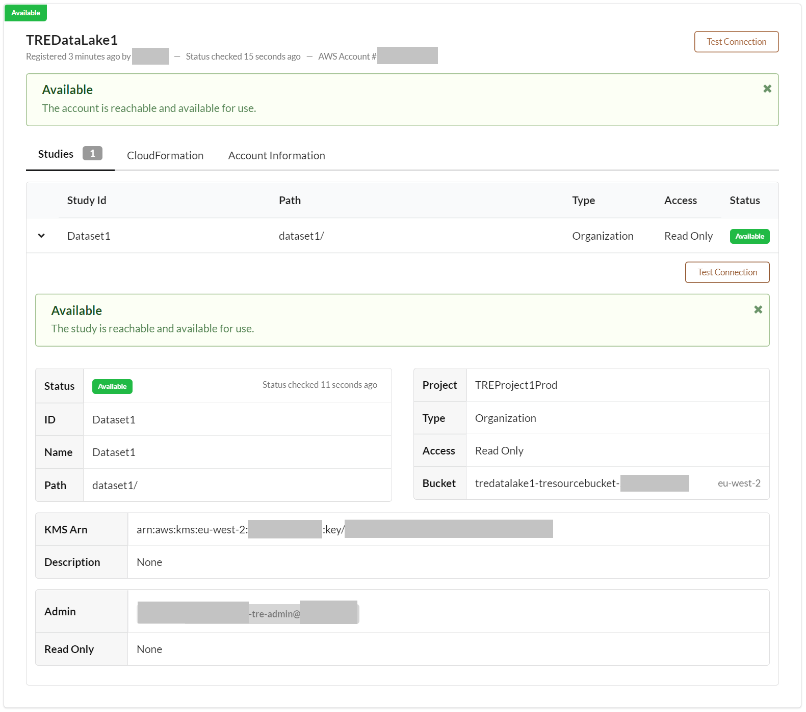
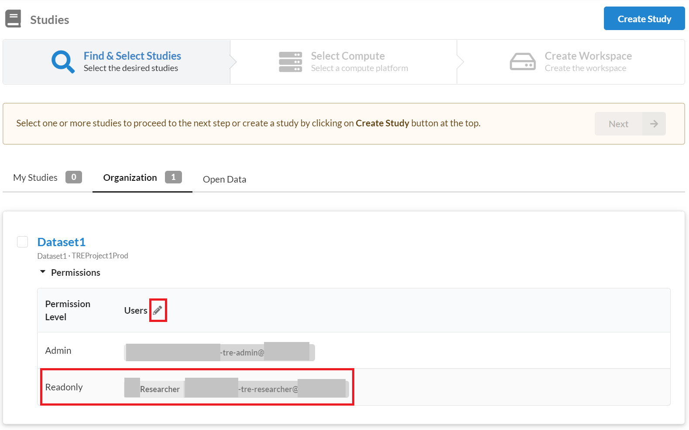
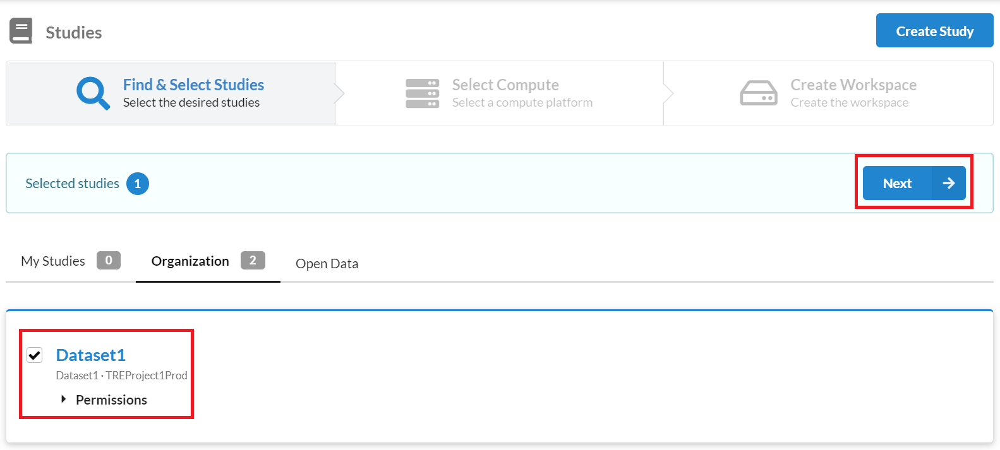
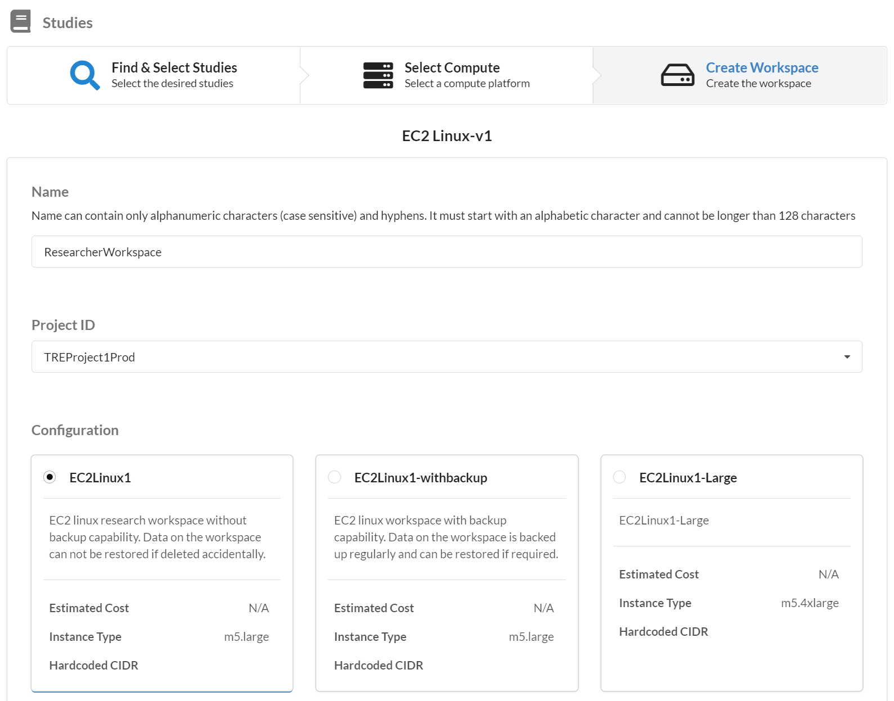
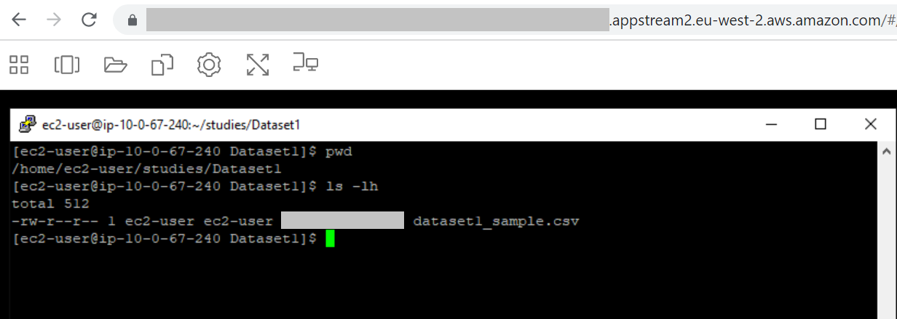

# Data Lake

The TREEHOOSE TRE solution contains a data lake that needs to be deployed
 with every TRE project. The data lake is used to store and manage datasets in an
 environment which can be governed securely.

## Data Ingestion

[Amazon S3](https://aws.amazon.com/s3/) provides a cost-effective way to store
 large amounts of data in an easy-to-use secure way. The data lake deployed
 uses S3 buckets to store datasets and results for research activities.

Data Lake Managers are responsible for uploading datasets into the data lake
 and ensuring the data has been processed and it's ready for research activities.

The **TRE Source Bucket** is created after
 [deploying the data lake](../deployment/Step3-CreateDataLake.md) and is registered
 with [AWS Lake Formation](https://aws.amazon.com/lake-formation/). [Data Lake Managers](../architecture/User-Personas.md#Data-Lake-Manager)
 can use this encrypted bucket to store data suitable as input for research activities.

Data Lake Managers can upload data to the **TRE Source Bucket** using
 [multiple methods](https://docs.aws.amazon.com/AmazonS3/latest/userguide/upload-objects.html)
 that are available for S3. When uploading large files to S3, they can leverage available
 [optimisation methods](https://aws.amazon.com/premiumsupport/knowledge-center/s3-upload-large-files/).

Optionally, Data Lake Managers:
* can apply ETL jobs on S3 buckets using [AWS Glue](https://aws.amazon.com/glue/) to prepare
 or transform the data before they store it in the **TRE Source Bucket** to share it with researchers.
* can query S3 data buckets like **TRE Source Bucket** using [Amazon Athena](https://aws.amazon.com/athena)
 and store the results in another S3 bucket e.g. **TRE Analyst Bucket**

To learn more about Amazon S3, check the
 [official user guide](https://docs.aws.amazon.com/AmazonS3/latest/userguide/Welcome.html).

To learn more about AWS Glue, check the
 [official documentation](https://docs.aws.amazon.com/glue/index.html).

To learn more about Amazon Athena, check the
 [official user guide](https://docs.aws.amazon.com/athena/latest/ug/getting-started.html).

## Data Usage

Before proceeding with the instructions below, review the
 [TRE user personas](../architecture/User-Personas.md).

### Step 1. Register Data Study in Service Workbench

User personas involved: IT Administrators and Data Lake Managers

As an IT Administrator, log in to the SWB Web App deployed in
 [Step 2 in the deployment guide](../deployment/Step2-DeployServiceWorkbench.md) using
 a SWB user account of type *admin*. Select menu option *Data Sources* on the left side
 and press on button *Register Studies*.

First provide the AWS account where the data resides. This will be the data lake account,
 e.g. **TRE Datalake 1 Prod**.

Provide the **TRE Source Bucket** bucket name and the KMS key used to encrypt it. In addition,
 specify the path to the dataset (in section *Studies*) that you wish to make available to researchers.
 If you need help finding these details, use the **TRE Datalake 1 Prod** account and check the
 [AWS CloudFormation](https://eu-west-2.console.aws.amazon.com/cloudformation/home?region=eu-west-2#/)
 *Resources* tab for *Stack* "TREDataLake1".

If the details are correct, you will see this status page.

SWB will generate a CloudFormation template as shown below.

As an IT administrator, you will first need approval from a Data Lake Manager
 to run the CloudFormation template that will make the data study available in SWB.
 If approval has been given, log in to the
 [AWS Management Console](https://console.aws.amazon.com/)
 using your **TRE Datalake 1 Prod** account and Admin privileges. Then use the
 *Create Stack* button from SWB to load the page below.

Run the stack and ensure it completes successfully. Then return to SWB and test the
 data study connection and ensure the status matches the image below.

### Step 2. Provide Researchers with access to Data Study

User personas involved: IT Administrators and Data Lake Managers

As an IT Administrator, log in to the SWB Web App deployed in
 [Step 2 in the deployment guide](../deployment/Step2-DeployServiceWorkbench.md) using
 a SWB user account of type *admin*. Select menu option *Studies* on the left side
 and select tab *Organization* to locate the previously created data study, e.g. *Dataset1*.

The data study admin can edit the permissions for the data study and in the example
 below the admin provided a researcher with read-only access to *Dataset1*. Note the
 admin should change permissions only if they got approval from the Data Lake Managers
 in charge of that data study.

### Step 3. Create Workspace with Data Study Attached

User personas involved: Researchers

The researcher who was provided with read-only access to the data study, e.g. *Dataset1*,
 can now create a workspace with this study attached. As a Researcher, select the study
 like in the image below.

Then create a SWB workspace with a suitable configuration that is available. An example
 is provided below.

Open a connection to the workspace to check the study data is mounted and the shared
 dataset can be accessed.

