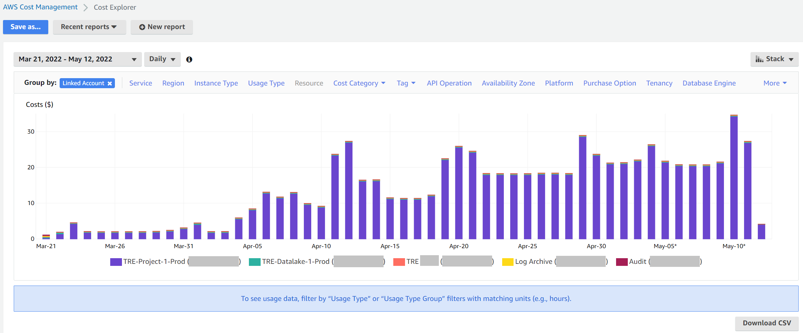
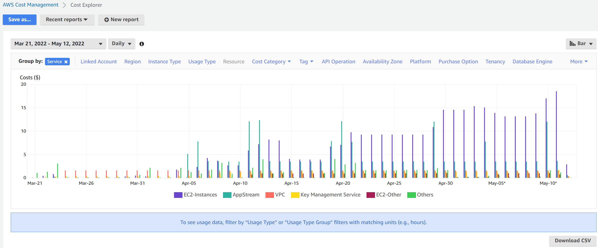
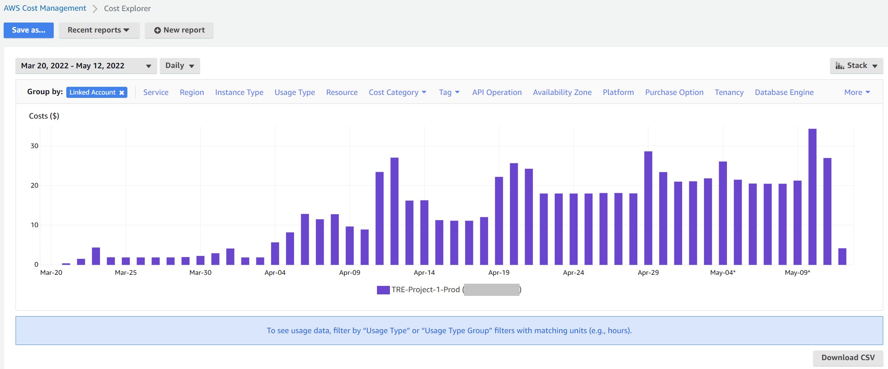

# Guidance - View Costs

One TRE project is defined using one AWS account (e.g. **TRE Project 1 Prod**) as described in the
 [deployment Prerequisites section](../deployment/Prerequisites.md). The costs associated with
 the TRE project are the costs incurred when using this dedicated AWS account.

The AWS account (e.g. **TRE Project 1 Prod**) will host only one SWB instance with one SWB project.
 We can view the total cost associated with a TRE project by checking the costs incurred when using
 the AWS account (e.g. **TRE Project 1 Prod**).

There will also be costs for the data lake account (e.g. **TRE Datalake 1 Prod**) linked to a
 TRE project, depending on how much data is stored and processed in it.

## AWS Cost Explorer

[AWS Cost Explorer](https://aws.amazon.com/aws-cost-management/aws-cost-explorer/) provides an
 easy-to-use interface to visualise costs. An example of daily costs associated with
 the all the accounts used for a TRE deployment is provided below.

> Note: The Management account should already have AWS Cost Explorer enabled as per the instructions
> in [Step 2 in the deployment prerequisites](../deployment/Prerequisites.md) section.

Log in to the [AWS Management Console](https://console.aws.amazon.com/)
 using your organization's **Management** account and Admin privileges.

- [ ] Go to Service:
 [AWS Cost Management](https://us-east-1.console.aws.amazon.com/cost-management/home?region=eu-west-2)
- [ ] Select the *Cost Explorer* menu option on the left side

AWS Cost Explorer provides several filters to generate a different view of the costs data. An example
 of using the *Service* filter is shown below.

You can also use AWS Cost Explorer in any of the member AWS accounts as shown below.

> Note: A new AWS account needs to initialise AWS Cost Explorer before it can use the service. Follow these
> [instructions](https://docs.aws.amazon.com/cost-management/latest/userguide/ce-enable.html) to enable it.
> This process can take around 24 hours to complete.

Log in to the [AWS Management Console](https://console.aws.amazon.com/)
 using your **TRE Project 1 Prod** account and Admin privileges.

- [ ] Go to Service:
 [AWS Cost Management](https://us-east-1.console.aws.amazon.com/cost-management/home?region=eu-west-2)
- [ ] Select the *Cost Explorer* menu option on the left side

## Cost Control

To set a budget limit for a TRE project and prevent further resource creation when the limit
 is reached, deploy the optional
 [Project Budget Controls component](../deployment/Step5-AddProjectBudgetControls.md).

## Service Workbench

This section applies only to the payer account, e.g. your organization's **Management** account.

An IT admin can add tags to workspace configurations in SWB. These custom tags can be
 seen in [AWS Billing](https://aws.amazon.com/aws-cost-management/aws-billing/). You can activate the
 associated [cost allocation tag](https://us-east-1.console.aws.amazon.com/billing/home?region=eu-west-2#/tags)
 to track costs for the group of resources (workspaces) created with that tag. An example of using the tag
 that shows if a workspace has backup enabled or not can be seen below.

To learn more about cost allocation tags, view the
 [AWS Billing user guide](https://docs.aws.amazon.com/awsaccountbilling/latest/aboutv2/cost-alloc-tags.html).

## Management Account

The **Management** account is defined in the [deployment prerequisites](../deployment/Prerequisites.md) section.
From a cost perspective, it has the responsibilities of a payer account and as such, it is responsible for
 also paying all the charges that are accrued by the member accounts (e.g. **TRE Project 1 Prod**).

This account can use
 [consolidated billing](https://docs.aws.amazon.com/awsaccountbilling/latest/aboutv2/consolidated-billing.html)
 to view AWS charges incurred by all other accounts in the AWS Organizations structure.

## Learn More

To learn about all the services that help with cost management, view the
 [AWS Cost Management user guide](https://docs.aws.amazon.com/cost-management/latest/userguide/what-is-costmanagement.html).
