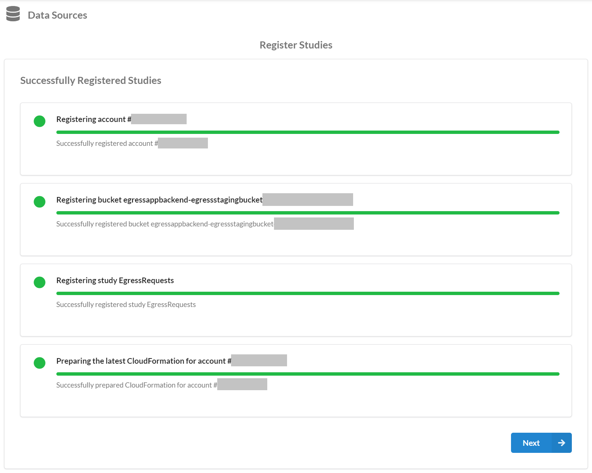
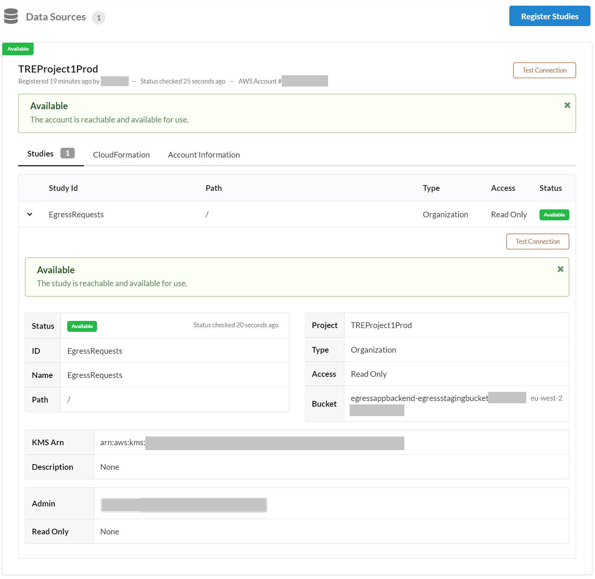

# Configuration Guide

Ensure all steps below are executed in AWS region: [London (eu-west-2)](https://eu-west-2.console.aws.amazon.com/).

**Total time to configure**: Approximately 30 minutes

To use the Egress Application add-on after deployment, a TRE admin must additionally configure user accounts
 and enable the information governance leads to review the data in the egress requests triggered by researchers.

There are 2 types of users involved in the Egress App workflow:

1) Information Governance Leads

- uses a SWB user account of type researcher to create a new workspace to view the contents of the data egress request
- uses an Egress App user account to provide the 1st approval for a data egress request

1) Research IT Admins

- uses a SWB user account of type admin to validate that an information governance lead is authorised to grant their approval
- uses an Egress App user account to provide the 2nd approval for data egress requests, only after the 1st approval has been granted

## Step 1. Setup Users

**Time to configure**: Approximately 15 minutes

Apply these steps only to accounts that are part of the **TRE Projects Prod** OU.

Log in to the [AWS Management Console](https://console.aws.amazon.com/) using your **TRE Project 1 Prod**
 account and Admin privileges.

### Part 1. SWB

Create Cognito users who can authenticate to the SWB website

In Cognito:

- [ ] Go to Service: [AWS Cognito](https://eu-west-2.console.aws.amazon.com/cognito/home?region=eu-west-2)
- [ ] Select [*Manage User Pools*](https://eu-west-2.console.aws.amazon.com/cognito/users/?region=eu-west-2)
- [ ] Select the *User Pool* for SWB called e.g. *treprod-pj1-userPool* (based on the SWB config file provided
 during [deployment Step 2C](../../deployment/Step2-DeployServiceWorkbench.md))
- [ ] Under *General settings*, select menu option *Users and groups*
- [ ] Use button *Create user* to create at least one SWB user to represent an Information Governance Lead
- [ ] Use button *Create user* to create at least one SWB user to represent a Research IT Admin

In SWB:

- [ ] Log in to SWB using the root account (based on the SWB config file provided during
 [deployment Step 2C](../../deployment/Step2-DeployServiceWorkbench.md))
- [ ] Go to menu option *Users*
- [ ] For each user previously created in Cognito use buttons *Detail* -> *Activate User* to activate them to allow login
- [ ] For each user of type Information Governance Lead previously created in Cognito use buttons *Detail* -> *Edit*
 to select *User Role*: researcher
- [ ] For each user of type Research IT Admin previously created in Cognito use buttons *Detail* -> *Edit* to select *User Role*: admin

### Part 2. Egress App

Create Cognito users who can authenticate to the Egress App website

- [ ] Go to Service: [AWS Cognito](https://eu-west-2.console.aws.amazon.com/cognito/home?region=eu-west-2)
- [ ] Select [*Manage User Pools*](https://eu-west-2.console.aws.amazon.com/cognito/users/?region=eu-west-2)
- [ ] Select the *User Pool* for the Egress App called e.g. *EgressUserPool**
- [ ] Under *General settings*, select menu option *Users and groups*. View tab *Groups*, you should see the 2 types
 of reviewers: InformationGovernance and TREAdmin
- [ ] Select tab *Users*
- [ ] Use button *Create user* to create at least one user of type Information Governance Lead. After creating the user,
 select it and use button *Add to group* to add it to the InformationGovernance group
- [ ] Use button *Create user* to create at least one user of type Research IT Admin. After creating the user, select
 it and use button *Add to group* to add it to the TREAdmin group

### Part 3. Notifications

Ensure Egress App users receive notifications when egress requests are triggered.

- [ ] Go to Service: [Amazon SNS](https://eu-west-2.console.aws.amazon.com/sns/v3/home?region=eu-west-2#/homepage)
- [ ] Select [*Topics*](https://eu-west-2.console.aws.amazon.com/sns/v3/home?region=eu-west-2#/topics)

Select topic *Information-Governance-Notifications*:

- [ ] For each user of type Information Governance Lead created in Part 2, use button *Create subscription* and
    select *Protocol*: Email. In *Endpoint* provide the user's email address. Submit and the user will receive an email to confirm the subscription

Select topic *ResearchIT-Notifications*:

- [ ] For each user of type Research IT Admin created in Part 2, use button *Create subscription* and select
    *Protocol*: Email. In *Endpoint* provide the user's email address. Submit and the user will receive an email to confirm the subscription

## Step 2. Setup Access for Information Governance Leads

**Time to configure**: Approximately 15 minutes

Before proceeding with the steps below, please be aware of the following limitations in SWB:

- The *Admin* permissions for a registered data study should always have at least one SWB user
 (of type Information Governance Lead) listed
- Do not add the same SWB user under both *Admin* and *Read Only* permissions for a registered data study as
 it leads to permission errors when viewing the study
- Once an external S3 bucket is registered as data study, it cannot be updated nor deleted. Please view the
 [troubleshooting guide](../../troubleshooting/TroubleshootingRunbook.md#external-data-studies) for instructions
 on how to handle this situation

Follow the instructions below to provide SWB users of type Information Governance Lead with access to view
 the egress requests made by researchers in SWB.

In SWB:

- [ ] Log in to SWB using an admin account
- [ ] Select menu option *Data Sources* and use button *Register Studies*, press *Next*
- [ ] Provide the following details:

|Parameter Name|Description|
|:-----------------|:-----------|
|AWS Account ID|Provide the ID for the **TRE Project 1 Prod** account|
|Account Name|Provide e.g. **TRE Project 1 Prod**|
|Region|Provide the AWS Region where the TRE project was deployed, e.g. *eu-west-2* for London |
|Bucket Name|Provide the name of the S3 bucket created by the Egress App as staging area for egress requests, e.g. EgressStagingArea... ; Check [AWS CloudFormation](https://eu-west-2.console.aws.amazon.com/cloudformation/home?region=eu-west-2#/) *Resources* tab for *Stack* "EgressAppBackend" to locate the S3 bucket|
|Bucket Region|Provide the AWS Region where the TRE project was deployed, e.g. *eu-west-2* for London |
|Bucket Default Encryption|Select *SSE-KMS* and provide the KMS Arn used for the Egress App staging area S3 Bucket's encryption key, e.g. EgressS3Key...; Check [AWS CloudFormation](https://eu-west-2.console.aws.amazon.com/cloudformation/home?region=eu-west-2#/) *Resources* tab for *Stack* "EgressAppBackend" to locate the KMS key|

- [ ] Press on button "Add Study":

|Parameter Name|Description|
|:-----------------|:-----------|
|Study Id & Study Name|Provide a name for the directory that will be mounted to a workspace, e.g. EgressRequests|
|Study Folder|Provide just the forward slash character */* . This will allow the Information Governance Lead to view all of the TRE project's egress requests for all workspaces|
|Project|Provide the associated SWB project e.g. *TREProject1Prod*|
|Type|Select *Organization Study*|
|Access|Select *Read Only*|
|Study KMS Arn|Provide the KMS Arn used for the Egress App staging area S3 Bucket's encryption key, e.g. EgressS3Key...; Check [AWS CloudFormation](https://eu-west-2.console.aws.amazon.com/cloudformation/home?region=eu-west-2#/) *Resources* tab for *Stack* "EgressAppBackend" to locate the KMS key|
|Admin|Select an existing SWB user account for the Information Governance Lead, as created in Step 1 - Part 1|

A message like this should appear after registering the study:

A message like this should appear after successfully attaching the study:

To view data egress requests, a SWB user of type Information Governance Lead needs to launch a SWB Workspace
 with this Study attached to it.
