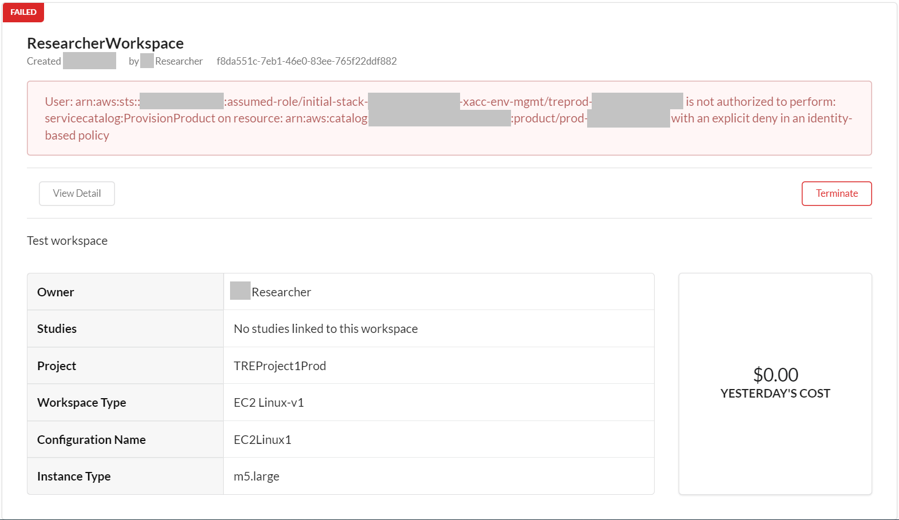
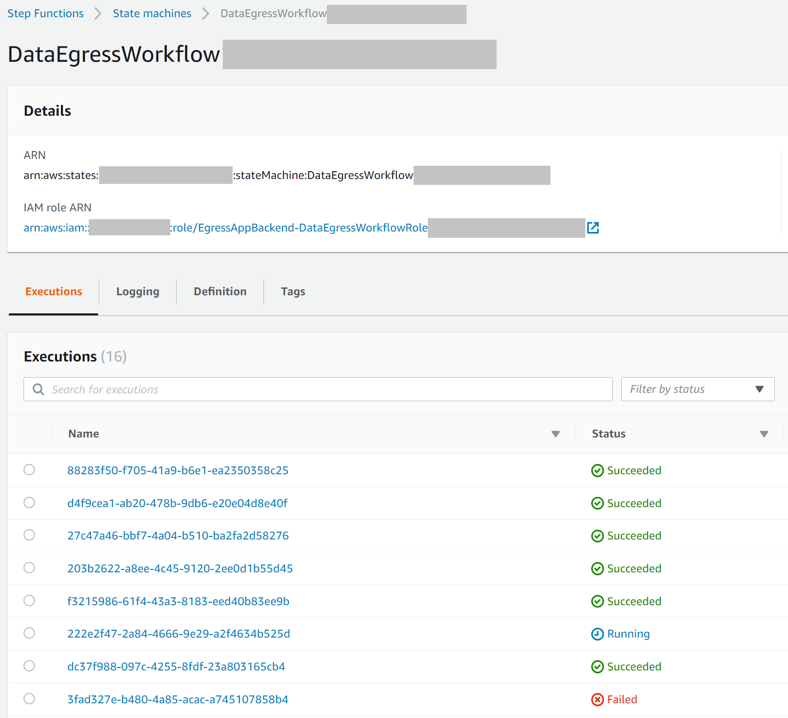
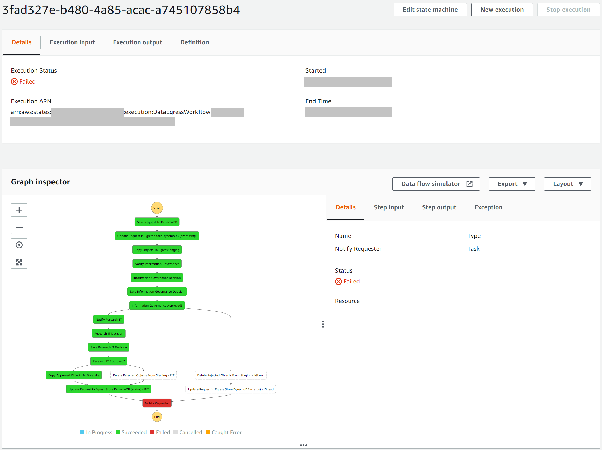
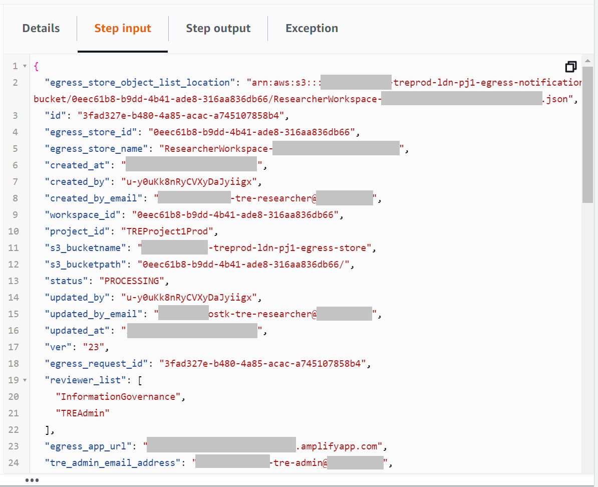
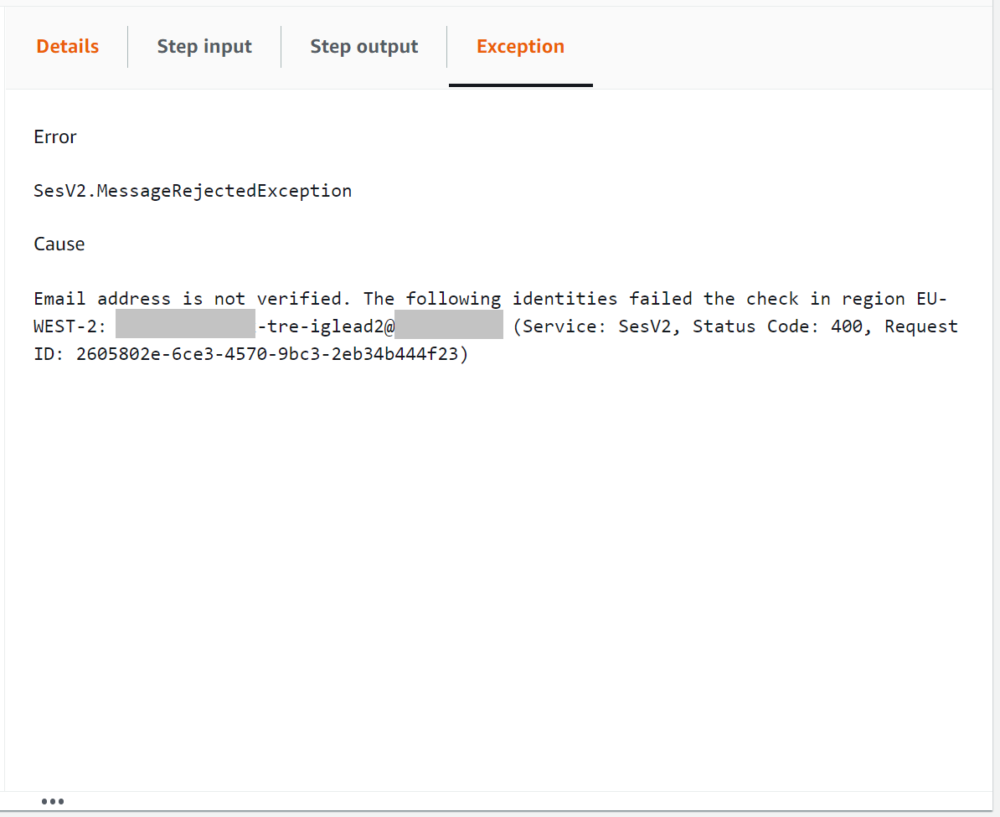
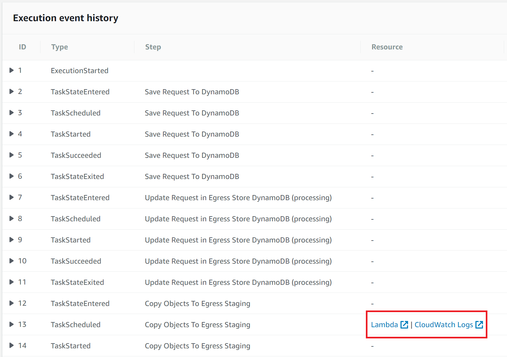
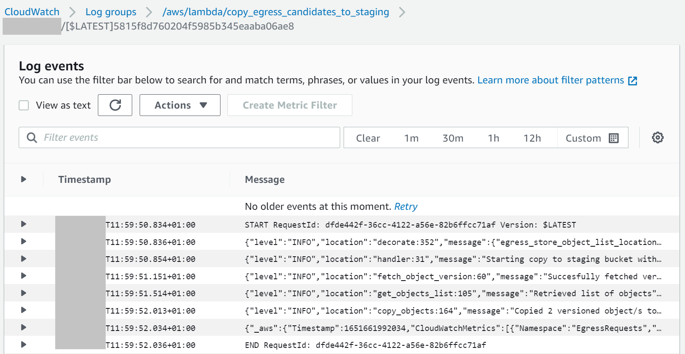

# Troubleshooting Runbook

The guidance below should help troubleshoot common issues identified in the TRE solution.

## AWS Accounts

### Compute service limits

Some services such as AWS Control Tower or Amazon AppStream 2.0 are affected by service limits usually
 affecting new AWS accounts. To fix these availability issues, you can try [launching and terminating at
 least one Amazon EC2 instance](https://docs.aws.amazon.com/AWSEC2/latest/UserGuide/LaunchingAndUsingInstances.html)
 (size of instance and run duration prior to termination do not matter).

## ServiceWorkbench (SWB)

For general guidance on operating the ServiceWorkbench web application, please visit
 the official [documentation page](https://github.com/awslabs/service-workbench-on-aws/tree/v5.1.1/docs).

For known issues affecting the ServiceWorkbench codebase, please visit the official
 [GitHub Issues page](https://github.com/awslabs/service-workbench-on-aws/issues).

### AppStream

Due to limitations from the EC2 service, there is a 60 seconds time window to connect to a SWB workspace
 via an AppStream connection. The process to connect usually takes longer than that if the AppStream instance
 needs to warm up, so after the AppStream connection becomes available for use, you can click again on the
 *Use this SSH Key* button in the SWB website which will trigger another 60 seconds countdown. Please note
 you cannot connect to the workspace from the AppStream instance if the countdown has expired, so make sure
 to return to the SWB website and repeat the *Use this SSH Key* procedure as many times as needed.

### Project Budget Controls

When the optional component for project budget controls is deployed, a budget threshold will be set. When that
 limit is reached, an automatic policy will be applied which will prevent new SWB workspace creation. The error
 message a researcher or admin will see in SWB is shown below.

To allow more workspaces to be created, a TRE administrator needs to:

1. Adjust the budget amount or threshold (Follow [Step 5D](../deployment/Step5-AddProjectBudgetControls.md)
 in the deployment guide for instructions)

1. Remove the IAM policy attached to the SWB IAM role controlling the workspace creation workflow
 (Follow [Step 5E](../deployment/Step5-AddProjectBudgetControls.md) in the deployment guide for instructions)

### External Data Studies

Limitations in SWB prevent changes to registered data studies. In some cases, selecting certain permissions could
render the data study unusable. To be able to register the study again using different settings, a TRE administrator
 will need to delete some SWB resources in the AWS Management Console. **There is a risk of damaging the SWB environment
 if the wrong resources are deleted, therefore caution is advised.**

To remove the data study with issues from the SWB website, follow the instructions below.

Log in to the [AWS Management Console](https://console.aws.amazon.com/) using your **TRE Project 1 Prod** account and Admin privileges.

- [ ] Go to Service: [Amazon DynamoDB](https://eu-west-2.console.aws.amazon.com/dynamodbv2/home?region=eu-west-2#service)
- [ ] Select the [*Tables*](https://eu-west-2.console.aws.amazon.com/dynamodbv2/home?region=eu-west-2#tables) menu option on the left side
- [ ] Locate the data study (with the name provided when it was registered in SWB) in DynamoDB table *treprod-ldn-pj1-Studies*
 and delete the item/row
- [ ] If required, also locate the bucket name (the data study's source reference) in DynamoDB table *treprod-ldn-pj1-DsAccounts*
 and delete the item/row

You can now try registering the data study again in SWB.

### Workspace Launch Times

If a researcher notices that the SWB workspace creation takes a long time, they should contact their TRE administrator to investigate.

### S3 File Mounts

SWB workspaces use S3 file mounts which come with some limitations.

## Egress Add-On Application

### Egress Workflow

This section describes troubleshooting steps and tips for the egress workflow (StepFunction tasks).
 The [AWS StepFunctions](https://eu-west-2.console.aws.amazon.com/states/home?region=eu-west-2#/statemachines)
 service should be the first point of contact for any monitoring, debugging or troubleshooting actions.

Below are some debugging steps which can be followed to identify an issue in the egress workflow.
 This includes any errors arising between the time the egress request submission button is clicked in SWB
 to the time the request has been egressed or rejected.

1. Identify the egress request ID which caused the issue. This should be done by visiting the
 [AWS StepFunctions](https://eu-west-2.console.aws.amazon.com/states/home?region=eu-west-2#/statemachines) service.
 By clicking on the **DataEgressWorkflow** state machine, you will be able to see all of the current and past
 workflow executions. The most recent execution will be listed at the top. Failed executions will be noticeable
 through the execution status, as seen below.

    The Execution ID is the same as the Egress Request ID, a unique 36 character string that can be used to
 identify an egress request. The ID can also be found in the Egress App.

    

1. Once the egress request has been identified, you can click on the execution to view the graph inspector,
 which displays each stage of the worfklow execution. The stages show the workflow order and are either
 displayed in green or red to indicate a success or a failure.

    

1. The red stage on the graph indicates that the issue happened during its execution. By clicking on the stage,
 you can analyse details associated with the stage such as the input data supplied to the stage, the data output
 from the stage, and the exception (error logs) produced. A few examples are shown below.

    

    

1. Below the graph inspector, the execution event history can be used to analyse a timestamped series of events
 from the workflow execution. If the failed stage would involve a Lambda function, the Lambda configurations (code,
 permissions) and logs can be accessed by clicking on the associated links.

    

1. If the root cause has still not been identified with a Lambda function, further analysis through CloudWatch logs
 can be performed. Use the link in the execution event history to access the Lambda log group.

    - Click on the '__Search all__' button and use the '__filter events__' input
    - Pass the __Egress Request ID__ in double quotes and search for
      - e.g. "b0d2aa37-f0b7-4898-98a2-e1d588a2a447"
    - Expand one of the returned event messages to retrieve the __function_request_id__
    - Pass the __function_request_id__ in double quotes and search for
      - e.g. "f7f57dbb-2b1e-43c8-817d-b56a193d785a"
    - Click on any of the log stream names in the returned event messages

    This will display all timestamped log messages output by the Lambda function during execution. All messages will
 be associated with the specified egress request ID.

    Depending on the log level configured, different logs will be visible in CloudWatch. Setting log level to
 DEBUG will provide additional useful information such as the name of the S3 bucket used in the function. Log level
 can be set by passing in the environment variable LOG_LEVEL to the Lambda function.

    

    For additional troubleshooting guidance check the documentation for
 [Lambda functions](https://docs.aws.amazon.com/lambda/latest/dg/lambda-troubleshooting.html)
 and [Appsync APIs](https://docs.aws.amazon.com/appsync/latest/devguide/troubleshooting-and-common-mistakes.html).

### Failure Scenarios

The use of a task token has a side-effect that an egress request can only be updated once for a given token.
 If something were to go wrong in the workflow after the user has made their decision in the front-end, it would
 not be possible for them to save their decision again. If they tried to do so, they would get a `Null...coerced...` error.
 One way of getting around this without needing the researcher to resubmit their egress request again is to do the following:
  * In the [AWS Step Functions](https://eu-west-2.console.aws.amazon.com/states/home?region=eu-west-2#/statemachines) service,
  identify and select the execution that has the issue
  * Once inside the chosen execution, click the __New Execution__ button. This will clone the existing
  execution into a new one whilst keeping the same egress request ID
  * The egress request will be reset back to the **PENDING** state in the Egress App
