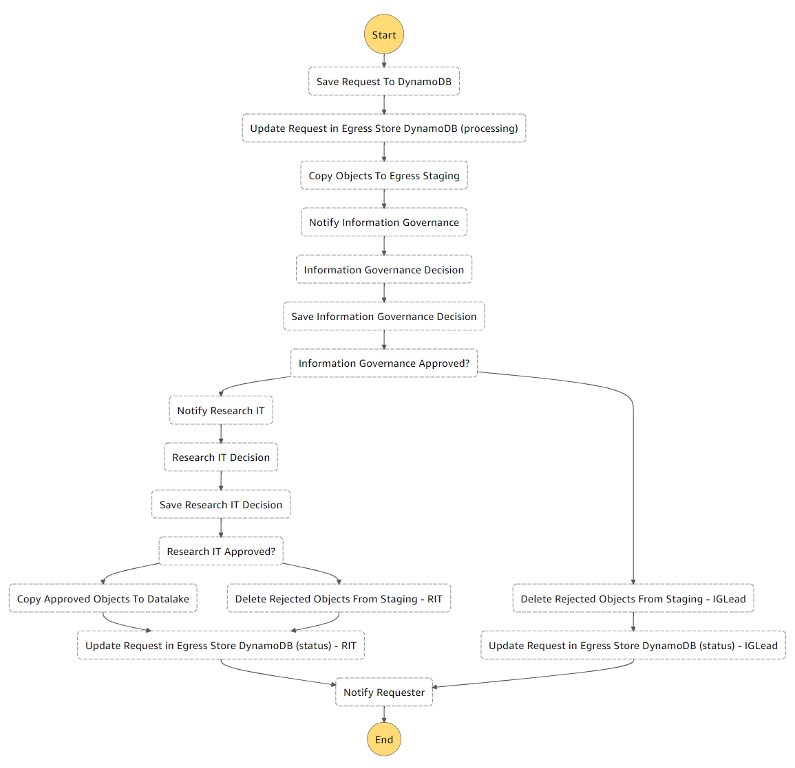

# Egress App Back-End

* [1. Egress Backend Stack](#1-egress-backend-stack)
  * [1.1. Egress Request DynamoDB Table](#11-egress-request-dynamodb-table)
  * [1.2. AppSync API](#12-appsync-api)
  * [1.3. GraphQL Schema Change](#13-graphql-schema-change)
  * [1.4. Egress Staging S3 Bucket](#14-egress-staging-s3-bucket)
  * [1.5. Start Egress Workflow Lambda Function](#15-start-egress-workflow-lambda-function)
  * [1.6. Egress Workflow Step Function](#16-egress-workflow-step-function)

The egress application backend is defined as a Python-based [CDK](https://aws.amazon.com/cdk/) (Cloud Development Kit)
 application. The app consists of one stack representing the infrastructure for the egress app backend.

## 1. Egress Backend Stack

The ___egress_backend/egress_backend_stack.py___ defines the resources that make up the egress approval workflow.
 These include the series of Lambda functions in the StepFunctions (Egress workflow) and the Amplify app hosting
 the user interface (Egress Web App).

The egress workflow utilizes [AWS Step Functions](https://aws.amazon.com/step-functions/) which is
 a visual workflow service that orchestrates a series of [Lambda](https://aws.amazon.com/lambda/) functions and tasks
 that define the data egress approval process.

### 1.1. Egress Request DynamoDB Table

This table is used to store egress requests as they are received from SWB. These requests are shown in the web app
 for approval/rejection and all status updates are applied to the entries in this table. The table is encrypted with
 a dedicated DynamoDB customer-managed KMS key.

### 1.2. AppSync API

[AWS AppSync](https://aws.amazon.com/appsync/) is a fully managed service that makes it easy to develop GraphQL APIs
 by handling the heavy lifting of securely connecting to data sources like DynamoDB, Lambda, and more. [GraphQL](https://graphql.org/)
 is a query language for the API, and a server-side runtime for executing queries using a type system defined for your data.
 The data types are defined in __egress_backend/graphql/schema.graphql__ and include the definition of an egress request
 and its attributes. Additionally, definitions of data queries and mutations (updates) are also included:

* listRequests - Lists all egress requests (Query)
* updateRequest - Updates a given request with approval status, justification, and approver name (Mutation)
* downloadData - Generates a S3 presigned URL which will be used by the frontend to download data associated with the request (Mutation)

Appsync uses the schema in combination with resolvers (defined in egress_backend_stack.py), which provides integration with a single Lambda
 (Egress-API) executing the business logic for the API.

The Lambda code is defined in ___egress_backend/lambda/egress_api__ where __main.py__ serves as the entry point. This script is called
 anytime the AppSync endpoint is called and is able to filter (switch cases) the request type and execute different scripts containing
 differing business logic.

* **List Requests API**
  * ***Request Parameters:*** None
  * ***Response:*** List of egress request objects
  * Calling the endpoint with the listRequests query will invoke the `list_request.py` script through `main.py`. This function
    executes a table scan to retrieve all of the egress requests from the DynamoDB table.

* **Update Requests API**
  * ***Request Parameters:*** egress_request_id, workspace_id, download_count
  * ***Response:*** String (Success message)
  * Calling the endpoint with the updatesRequests mutation will invoke the `update_request.py` script through `main.py`. The function
    starts off by checking if the supplied request_id is valid by querying the database. After successful verification of the request,
    the supplied task token is used to resume the relevant egress workflow (StepFunctions) execution passing in an approval or rejection status.
    The supplied reason is used later in the workflow to update the request details in the database.

* **Download Data API**
  * ***Request Parameters:*** egress_request_id, status, download_count
  * ***Response:*** String (S3 presigned URL)
  * Calling the endpoint with the downloadData mutation will invoke the `download_data.py` script through `main.py`. The function first checks
    if the download_count exceeds a configurable parameter `max_downloads_allowed` (specified in `cdk.json`). If the max download count has not
    been exceeded, the script proceeds to construct the object key from the supplied parameters. If the file exists in the datalake bucket, a S3
    presigned URL is generated and returned as a string. After successful generation, the download_count attribute for the request is updated in
    the table. Note that the frontend maintains the running total as the user clicks on the button and once the limit is reached (by checking the
    same configurable parameter), the download button is disabled. The running total is always sent to the backend with any download requests so
    that if needed, the database table can be updated.

### 1.3. GraphQL Schema Change

>Note: This requires installation of Amplify CLI - instructions can be found [here](https://docs.amplify.aws/cli/start/install)

Any changes to the GraphQL schema should be made inside ___egress-backend/egress_backend/graphql/schema.graphql__ in the backend.
 This file should then be copied/overwritten to this location ___egress-webapp/src/graphql/schema.graphql___ in the client.
 Then run the command `amplify add codegen` in ___egress-webapp/src/graphql___ to generate the updated models for the client to use.
 You should see updated queries/mutations/subscriptions.js files in the same location.

### 1.4. Egress Staging S3 Bucket

S3 bucket used to temporarily stage candidate egress objects so they can be inspected by the reviewer(s).
 This is an unversioned bucket as it is not designed for long-term storage of data. Once an egress request has been approved/rejected,
 its related data in this bucket is deleted immediately. The bucket is encrypted with a dedicated S3 customer-managed KMS key.

### 1.5. Start Egress Workflow Lambda Function

AWS Lambda function that is subscribed to a SWB-managed SNS topic in order to receive notifications of new egress requests. This function
 invokes the step function that defines the egress approval workflow. It also feeds configuration parameters into the workflow which will
 be used at various points. Among the key values are:
  * ___egress_request_id___: Unique identifier for an egress request.
  * ___reviewer_list___: List of user groups (as defined in the IdP) that have approval responsibility. The list ordering should reflect
  the approval priority.
  * ___egress_app_url___: URL for the egress application. Used when sending the final decision email to the requester.
  * ___tre_admin_email_address___: Email address for the TRE administrator(s) or administrator group. Also used as the "From" email address
  for the final decision email. The email body also references this email address.

### 1.6. Egress Workflow Step Function

* ***Save Request To DynamoDB:***
  * Step Function task which uses direct integration with Amazon DynamoDB to write the request to the Egress Request DynamoDB table
  * The status of the entry is set to ***PROCESSING** to maintain consistency with the SWB Egress store status update below

* ***Update Request in Egress Store DynamoDB (processing):***
  * Step Function task which uses direct integration with Amazon DynamoDB to update the egress store item status in the SWB DynamoDB
  table to ***PROCESSING***
  * With this status in place, the researcher is not permitted to terminate the workspace (& associated egress store) because there
  is a request in flight

* ***Copy Objects to Egress Staging:***
  * Step Function task which uses an AWS Lambda function (`copy_egress_candidates_to_staging`) to:
    * Retrieve the JSON version metadata file from the `egress_store_object_list_location` in the inbound SNS message
    This file contains a list of candidate egress objects and their associated S3 Version IDs that relate to this particular egress
    request. This feature allows the linking between an egress request and a specific version of an object in the SWB egress store
    even if said object is modified multiple times
    * Copy the candidate egress objects from the SWB Egress store location to the staging bucket. The version ID specified in the
    JSON file above is specified in the copy command. This is the version that will be copied ***even if it is not the current version***
    in the source egress store bucket
    * Extract a list of distinct file types being staged. This list will be fed into the step function so that it can be included
    in notification alerts

* ***Notify Information Governance:***
  * Step Function task which uses direct integration with Amazon SNS to:
    * Publish a notification to the Information Governance SNS topic
    * Format the notification to include:
      * File types
      * Egress Request ID
      * Research Project
      * Researcher Email

* ***Information Governance Decision:***
  * Step Function task which uses an AWS Lambda function (`update-egress-request-with-task-token-function`) to write a step function
  task token as an attribute of the egress request item in the DynamoDB table
  * The task pauses and waits for a callback which includes the token before it can resume execution
  * Callback will be received via a GraphQL API call from the frontend which will be processed by the `egress-api-handler`
  * Validation in the API will ensure that only the Information Governance role can update the request at this point in time

* ***Save Information Governance Decision:***
  * Step Function task which uses direct integration with Amazon DynamoDB to update the Information Governance decision in the DynamoDB table
  * This task is triggered by the UpdateRequest API being invoked. The API invokes a Lambda function which uses the task token previously
  retrieved (when requests were loaded in the frontend) to resume the step function execution

* ***Information Governance Approved?:***
  * Step Function choice task which parses the status of the request as received from the frontend API call in the previous task to determine
  if the request was **APPROVED** or **REJECTED** by Information Governance

* ***Delete Rejected Objects From Staging - IGLead:***
  * When **REJECTED** by Information Governance, the Step Function task uses an AWS Lambda function (`handle_egress_rejection`)
  to delete staged objects from the Egress staging bucket (with the expectation that the researcher will review and submit a new egress request)

* ***Notify Research IT:***
  * If the request is **APPROVED**, control is passed to a Step Function task which uses direct integration with Amazon SNS to:
    * Publish a notification to the Information Governance SNS topic
    * Format the notification to include:
      * File types
      * Egress Request ID
      * Research Project
      * Researcher Email
      * Information Governance Email

* ***Research IT Decision:***
  * Step Function task which uses an AWS Lambda function (`update-egress-request-with-task-token-function`) to write a step function
  task token as an attribute of the egress request item in the DynamoDB table
  * The task pauses and waits for a callback which includes the token before it can resume execution
  * Callback will be received via a GraphQL API call from the frontend which will be processed by the `egress-api-handler`
  * Validation in the API will ensure that only the Research IT role can update the request at this point in time

* ***Save Research IT Decision:***
  * Step Function task which uses direct integration with Amazon DynamoDB to update the Research IT decision in the DynamoDB table.
  * This task is triggered by the UpdateRequest API being invoked. The API invokes a Lambda function which uses the task token previously
  retrieved (when requests were loaded in the frontend) to resume the step function execution

* ***Research IT Approved?:***
  * Step Function choice task which parses the status of the request as received from the frontend API call in the previous task
  to determine if the request was **APPROVED** or **REJECTED** by Research IT

* ***Delete Rejected Objects From Staging - RIT:***
  * When **REJECTED** by Research IT, the Step Function task uses an AWS Lambda function (`handle_egress_rejection`) to delete staged
  objects from the Egress staging bucket (with the expectation that the researcher will review and submit a new egress request)

* ***Copy Approved Objects to Datalake:***
  * If the request is **APPROVED**, control is passed to a Step Function task which uses an AWS Lambda function
  (`copy_egress_candidates_to_datalake`) to:
    * Download the approved egress objects unto an EFS file store that is attached to the Lambda function
    * Create a zip file containing all the objects
    * Upload the zip file to the datalake target S3 bucket
    * Clean up all related data from both the egress staging bucket and the EFS

* ***Update Request in Egress Store DynamoDB (status):***
  * Step Function task which uses direct integration with Amazon DynamoDB to update the egress store item status in the SWB DynamoDB
  table as follows:

    | Egress App Status | SWB Egress Store Status |
    |:-----------------:|:-----------------------:|
    | APPROVED          |   PROCESSED             |
    | REJECTED          |   PENDING               |

  * Setting the status to ***PROCESSED*** allows the researcher to terminate the research workspace and associated egress store
  * Setting the status to ***PENDING*** allows the researcher to revise and resubmit the candidate egress data. They may also choose
  to terminate the research workspace and associated egress store at this stage. (They could not do so while the request was in a status
  of ***PROCESSING*** which is set when the egress request is first received by the step function.)

* ***Notify Requester:***
  * Step Function task to send an email to the requester (e.g. researcher) with the Information Governance lead in copy. The email marks
  an egress request review as complete and provides instructions with next steps.
